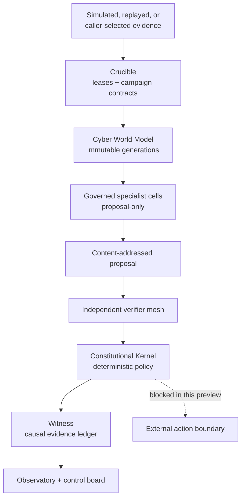
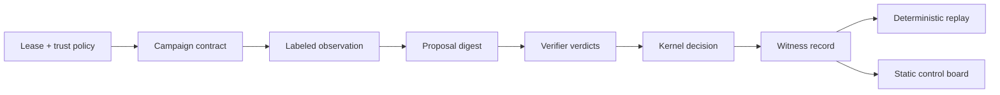
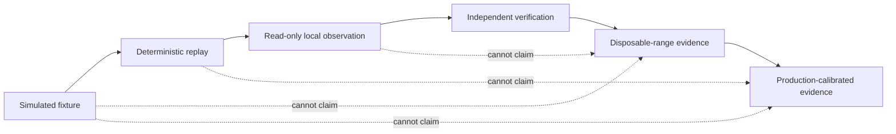

# nimrod

<div align="center">

**Constitutional cyber-defense research where evidence never becomes its own authority.**

Local-first. No-execution by default. Deterministic under replay.<br>
Fail-closed when identity, provenance, isolation, or proof is incomplete.

[](https://github.com/ObtuseAI/nimrod/actions/workflows/quality.yml)
[](https://www.python.org/)
[](docs/DOCTRINE.md)
[](.github/workflows/quality.yml)
[](LICENSE)

</div>


nimrod is an inspectable research system for coordinating defensive reasoning without confusing intelligence, telemetry, consensus, signatures, or successful simulations with permission.

It combines versioned security contracts, a no-execution simulator, a governed specialist swarm, replay-safe world modeling, read-only edge observation, independent cross-language verification, constitutional policy, and an immutable Witness trail.

The public release is a **research preview and reference implementation**. It is not antivirus, EDR, containment software, a deployable protection product, or authorization to operate against a target.

> Governors schedule. Organisms propose. Verifiers measure.<br>
> The Constitutional Kernel alone evaluates deterministic policy.

## Read this status first

The current operational posture is:

`CONSTRUCTION_ZONE_PROVISIONING_SIGNED_DENIAL_INDEPENDENT_ATTESTATION_BLOCKED`

That long status is deliberate. The repository proves local contract, simulation, replay, packaging, read-only observation, and fail-closed governance behavior. It does **not** currently prove:

- construction-zone provisioning;
- independently retained isolation evidence;
- production key custody;
- connection to a disposable defensive range;
- real campaign execution;
- containment or active-baseline mutation;
- production-calibrated prevention, detection, response, or recovery;
- promotion into a production authority plane.

nimrod reports that boundary in the landing page because a security research system should make the difference between architecture and operational evidence impossible to miss.

## nimrod in one minute

| Question | Answer |
| --- | --- |
| **What is it?** | A constitutional control system for defensive evidence, simulated campaigns, governed research, and replay-safe verification. |
| **What problem does it study?** | How a defensive system can learn and coordinate without letting models, telemetry, evaluators, or success metrics authorize action. |
| **What goes in?** | Signed or labeled fixture contracts, replayed observations, caller-selected read-only evidence, versioned policy, and explicit leases. |
| **What comes out?** | Content-addressed proposals, causal verdicts, verification records, Witness entries, and exact blocked or admissible states. |
| **What can a reader run?** | The complete contract validator, independent TypeScript evaluator, no-execution simulator, fixture replays, and static control board. |
| **What is the authority ceiling?** | Proposal, simulation, replay, observation, and verification. The public preview does not expose active target mutation. |

## The security problem is authority confusion

An advanced defense system consumes untrusted and uncertain material:

- endpoint observations;
- detections and alerts;
- model-generated hypotheses;
- external intelligence;
- retrieved documents;
- evaluator scores;
- peer votes;
- prior campaign results;
- signed messages from identities whose scope may still be wrong.

Each item may be useful evidence. None is permission by itself.

nimrod therefore treats the following as separate questions:

1. **Origin** — where did this record come from?
2. **Identity** — what exact principal, source, build, and policy produced it?
3. **Scope** — what host, process, campaign, time window, and purpose does it cover?
4. **Freshness** — is it still valid for the decision being made?
5. **Integrity** — do digests, schemas, signatures, and causal links verify?
6. **Independence** — was the result checked outside the proposing context?
7. **Authority** — even if the evidence is true, does policy permit the requested transition?

```mermaid
flowchart LR
    CONTENT["Model output / telemetry / document / score"]
    ORIGIN["Origin + provenance"]
    IDENTITY["Principal + build identity"]
    SCOPE["Purpose + target + time scope"]
    VERIFY["Independent verification"]
    POLICY["Deterministic constitutional policy"]
    WITNESS["Immutable Witness record"]
    RESULT["Admit / deny / block"]

    CONTENT --> ORIGIN
    ORIGIN --> IDENTITY
    IDENTITY --> SCOPE
    SCOPE --> VERIFY
    VERIFY --> POLICY
    POLICY --> WITNESS
    WITNESS --> RESULT
    CONTENT -. "never authorizes itself" .-> RESULT
```



Missing, stale, malformed, self-attested, origin-ambiguous, scope-incompatible, or unverifiable evidence fails closed.

## Constitutional architecture

nimrod is organized as a separation-of-powers system:



### Constitutional laws

| Law | Practical consequence |
| --- | --- |
| **Evidence is not authority** | A true observation, high score, signed fixture, or unanimous vote still passes through deterministic policy. |
| **No self-verification** | The component that proposes a transition cannot be the sole verifier of that transition. |
| **No unlabeled reality claims** | Simulation, replay, observation, range evidence, and production evidence remain distinct classes. |
| **No execution by implication** | A lease or campaign description does not silently turn a simulator into an executor. |
| **No learning-based permission expansion** | Research may rank or revise proposals; it cannot widen scopes, targets, credentials, or release rights. |
| **No hidden uncertainty** | Unknown, missing, stale, denied, blocked, and inconclusive remain first-class terminal states. |
| **No active capability through generic dispatch** | Read-only interfaces do not smuggle containment or mutation behind an untyped command channel. |

## Capability atlas

### 1. Crucible contracts

The Crucible defines the governed campaign language. Its schemas cover:

- authorization leases and trust policy;
- signed authorization-proof bundles;
- campaign objectives, topology, limits, and expected evidence;
- verifier identities and threshold policy;
- range readiness and lifecycle;
- source staging and quarantine;
- recovery, migration, revocation, and teardown;
- content-addressed evidence and Witness records.

Contracts describe the requested world. They do not create that world or prove it exists.

### 2. No-execution simulator

The simulator exercises the authorization and evidence chain without touching a live target. It:

- validates a lease, campaign, authorization proof, trust policy, and control state;
- binds decisions to an operator-supplied time;
- produces deterministic proposal and verdict identities;
- records causal links between inputs, policy, decisions, and Witness entries;
- persists replayable state under a caller-selected output root;
- explicitly records `live_execution_performed: false`.

Cryptographic authorization establishes who authorized a fixture. It does not convert the fixture into efficacy evidence.

### 3. Governed specialist swarm

nimrod models seven typed cells:

| Cell | Research role | Authority ceiling |
| --- | --- | --- |
| **Red** | Develops adversarial hypotheses inside the supplied defensive campaign model. | Proposal-only; no target execution. |
| **Blue** | Develops defensive hypotheses and expected control effects. | Proposal-only. |
| **Purple** | Reconciles attack and defense assumptions into testable questions. | Cannot approve its own synthesis. |
| **Evidence** | Tracks provenance, contracts, identity, freshness, and causal support. | Evidence classification only. |
| **Recovery** | Designs rollback, survival, teardown, and last-known-good expectations. | Cannot initiate recovery externally. |
| **Verification** | Challenges claims and measures agreement with deterministic contracts. | Cannot grant policy authority. |
| **Safety** | Checks scope, privacy, isolation, denial, and residual-risk boundaries. | Can block; cannot activate. |

Cells exchange typed artifacts rather than an unrestricted conversation transcript. Distinct responsibilities make disagreement and missing roles observable.

### 4. CACIS

CACIS is the Constitutional Adaptive Cyber Immune System research layer. It explores continuous learning while remaining below constitutional authority.

Its implemented surfaces include:

- **Cyber World Model** — immutable observation records, derived generations, cursor-bound succession, retention, and backpressure;
- **Immune Runtime** — ephemeral organism leases, lifecycle events, teardown, and knowledge-survival rules;
- **Metabolism and homeostasis** — bounded resources, pressure signals, scheduling, and domain-specific clocks;
- **Genome evaluation** — candidate identity, fitness evidence, lineage, and shadow promotion;
- **Arenas and Observatory** — controlled evaluation contexts and reader-facing evidence inspection;
- **Evolution Foundry** — separation between candidate generation, evaluation, promotion, and constitutional policy;
- **research engine** — falsifiable hypotheses across a versioned set of constitutional intelligence questions.

A candidate can improve its rank or reach a bounded shadow state. Fitness does not create production authority.

### 5. Edge observation

The Edge surface provides caller-selected, read-only process evidence. It deliberately avoids broad endpoint powers:

- the caller identifies the process or input being observed;
- identity fields can be reduced to digests;
- observations carry purpose, origin, time, and retention metadata;
- the observer cannot enumerate arbitrary targets;
- the observer cannot contain, kill, modify policy, or invoke response;
- observations advance the world model only through governed intake.

This is an evidence sensor, not an endpoint agent.

### 6. Independent verification

The conformance layer includes a TypeScript evaluator built separately from the Python runtime. It checks cross-language agreement on canonical contracts and semantic mutations.

The verification ladder tests both positive and negative behavior:

- schema-valid examples;
- malformed and missing fields;
- changed identities and digests;
- stale or incompatible time windows;
- wrong scope or trust roots;
- replay and idempotency expectations;
- prohibited authority transitions;
- manifest drift.

The purpose is not merely to show that examples parse. It is to show that important invalid states are rejected by an independently built implementation.

### 7. Witness and observability

Witness records preserve the chain from input to decision:



The local control board displays repository-owned demo state. It has no backend, credentials, target connection, or execution authority.

## What you can do with the public preview

### Scenario A: audit the constitutional contract

Run the full validator and inspect which invariants survive mutation:

```powershell
.\tools\validate-foundation.ps1
```

This builds the independent evaluator, verifies the canonical manifest, runs the schema and semantic contract ladder, compiles Python surfaces, and retains honest blocked states where external evidence is unavailable.

### Scenario B: simulate an authorized campaign without executing it

```powershell
$runRoot = Join-Path $env:TEMP ("nimrod-simulator-" + [guid]::NewGuid())

.\.venv\Scripts\nimrod-simulate.exe `
  --project-root . `
  --lease .\specs\examples\authorization-lease.example.json `
  --campaign .\specs\examples\validation-campaign.example.json `
  --authorization-proof .\specs\examples\authorization-proof-bundle.example.json `
  --trust-policy .\specs\examples\authorization-trust-policy.example.json `
  --control-state .\tests\fixtures\simulator\control-state.valid.json `
  --output "$runRoot\witness" `
  --state-root "$runRoot\state" `
  --now 2026-07-12T19:05:00Z
```

Inspect the resulting Witness records, proposal identities, causal verdicts, and explicit no-execution field.

### Scenario C: study failure semantics

The conformance fixtures include invalid identity, scope, freshness, signature, authority, and evidence cases. Changing a canonical example does not produce a best-effort warning; the relevant validator fails with the contract violation.

### Scenario D: inspect the control board

```powershell
.\.venv\Scripts\python.exe -m http.server 8765 --bind 127.0.0.1 --directory .
```

Open `http://127.0.0.1:8765/ui/`. The board is useful for understanding the state model, not for operating a target.

## The evidence ladder

nimrod keeps evidence classes separate because each supports different claims:



| Evidence class | What it can establish | What it cannot establish |
| --- | --- | --- |
| **Simulation** | Contract shape, deterministic decision behavior, causal recording. | Real target behavior or defensive efficacy. |
| **Replay** | Reproducibility against retained inputs and policy. | Fresh observation or current-world performance. |
| **Read-only observation** | Labeled facts about a caller-selected local source. | Containment, prevention, or broad endpoint coverage. |
| **Independent verification** | Agreement or disagreement outside the proposer context. | Correctness beyond the verifier’s scope and assumptions. |
| **Disposable-range evidence** | Behavior in a provisioned, isolated, authorized range. | Production effectiveness without calibration and custody. |
| **Production-calibrated evidence** | Claims bounded to the measured deployment and operating policy. | Universal efficacy or authority outside that deployment. |

The public preview reaches the first four categories only in the specific implemented paths. The range and production categories remain blocked.

## AI assurance model

nimrod assumes that every intelligent component can be wrong, manipulated, overconfident, or contextually compromised.

| Failure mode | Control |
| --- | --- |
| Prompt injection or retrieved-content manipulation | Content remains data; provenance and typed contracts precede policy. |
| Model hallucination | Claims require source-linked evidence and independent verification. |
| Self-approval | Proposer, verifier, and constitutional policy remain separate. |
| Colluding agents | Distinct roles do not suffice; same-digest verification and deterministic policy are still required. |
| Reward hacking | Fitness changes ranking, never permission. |
| Stale world model | Immutable generations, cursor succession, freshness, retention, and backpressure. |
| Compromised plugin or release | Canonical manifest, package identity, release and plugin trust checks. |
| Irrecoverable adaptation | Leases, teardown, last-known-good state, Witness continuity, and recovery contracts. |
| Privacy overreach | Caller-selected observation, purpose limitation, digest identity, bounded retention. |

See [AI assurance](docs/AI_ASSURANCE.md) and the [threat model](docs/THREAT_MODEL.md) for the complete reasoning.

## Quick start

Requirements: Python 3.11+, Node.js 24+, and PowerShell 7 on Windows for the complete validation ladder.

```powershell
git clone https://github.com/ObtuseAI/nimrod.git
cd nimrod
python -m venv .venv
.\.venv\Scripts\python.exe -m pip install --upgrade pip
.\.venv\Scripts\python.exe -m pip install -e ".[validation]"
.\tools\validate-foundation.ps1
```

The package exposes the no-execution simulator and supporting research libraries. There is no public command that turns these contracts into active target execution.

## Release proof

The public quality workflow runs two separate jobs on clean Windows runners:

| Job | What it runs | Blocking proof |
| --- | --- | --- |
| **Constitutional validation** | Python installation, Node 24, independently built TypeScript evaluator, foundation validator, canonical manifest, every `validate_*.py` contract, Python compilation, and public-release hygiene. | Any failed validator blocks the workflow. |
| **Coverage** | The complete executable contract ladder under `coverage.py`. | `src` line coverage must remain at or above 76%. |

The workflow has read-only repository permissions, pins third-party actions to exact commits, and cancels stale concurrent runs. Passing CI proves the source-controlled local contract surface at that exact SHA; it does not satisfy the separate operational gates for design partners, range execution, hardware-backed custody, production calibration, or active response.

## Repository map

```text
specs/                   versioned contracts and clearly labeled examples
src/nimrod_simulator/    no-execution simulator, swarm, verifier, Witness
src/nimrod_edge/         replay and caller-selected read-only observation
src/nimrod_cacis/        world model, immune runtime, homeostasis, arenas
conformance/             independent TypeScript contract evaluator
tools/                   fail-closed validators, manifest, and release checks
ui/                      local static constitutional control board
docs/                    doctrine, threat model, decisions, and evidence guides
reports/                 machine-readable validation and readiness evidence
```

Recommended reading:

1. [Doctrine](docs/DOCTRINE.md) — mission, constitutional rule, and invariants.
2. [Reference architecture](docs/REFERENCE_ARCHITECTURE.md) — trust zones and component boundaries.
3. [Crucible](docs/CRUCIBLE.md) — lease, campaign, evidence, and Witness contracts.
4. [Governed swarm and control board](docs/SWARM_CONTROL_BOARD.md) — coordination without self-authority.
5. [AI assurance](docs/AI_ASSURANCE.md) — model threat coverage and controllability.
6. [Threat model](docs/THREAT_MODEL.md) — crown jewels, adversaries, and entry points.
7. [Public launch gates](docs/PUBLIC_LAUNCH.md) — the evidence required beyond this preview.
8. [Security policy](SECURITY.md) and [contribution guide](CONTRIBUTING.md).

## Who this is for

nimrod is intended for:

- defensive-security and assurance researchers;
- engineers studying constitutional control of AI systems;
- teams designing replay, provenance, evidence, and authorization contracts;
- evaluators who want negative tests and blocked states to be first-class results;
- readers interested in adaptive systems that remain below a human-owned authority boundary.

It is not intended as an operational security tool for end users.

## Scope, ethics, and limitations

Use nimrod only with systems, data, fixtures, and environments you are authorized to inspect. The public repository does not grant permission to test, scan, access, or interfere with any third-party system.

nimrod does not:

- provide exploit execution, persistence, evasion, lateral movement, containment, or destructive response;
- claim endpoint protection, production readiness, or measured defensive efficacy;
- provision a range, manufacture independent evidence, or replace external custody;
- make AI output trustworthy merely because it is signed, repeated, or agreed upon;
- convert research progress into deployment authority;
- eliminate the need for legal, privacy, safety, and human review.

The project’s most important result may sometimes be an exact denial or blocked state. That is a feature, not an unfinished success message.

## Citation and license

Citation metadata is available in [`CITATION.cff`](CITATION.cff).

Copyright © 2026 ObtuseAI. The source is available for evaluation, education, research, and portfolio review under the [ObtuseAI Source-Available License](LICENSE). Commercial, hosted, production, and redistribution rights require separate written permission.
