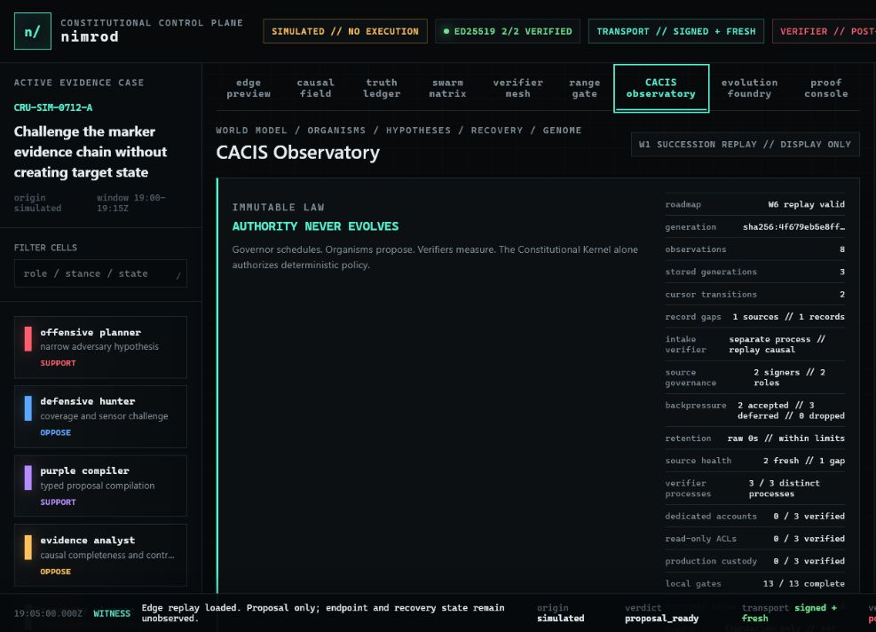
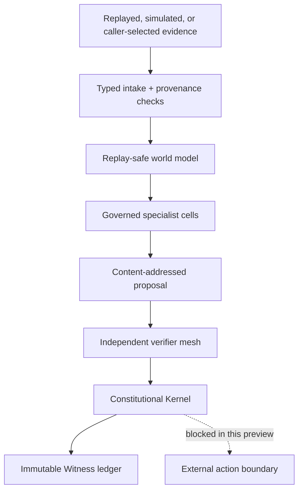
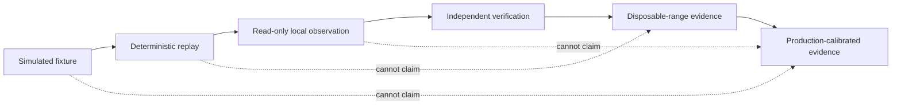
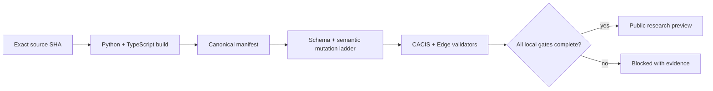

# nimrod

<div align="center">

**A constitutional cyber-defense research system that treats evidence as evidence—not authority.**

Local-first. No-execution by default. Fail-closed when proof is incomplete.

[](https://github.com/ObtuseAI/nimrod/actions/workflows/quality.yml)
[](https://www.python.org/)
[](docs/DOCTRINE.md)
[](LICENSE)

</div>



nimrod explores a difficult question: how can a defensive system learn, coordinate, and improve without letting its own models, telemetry, evaluators, or success metrics become permission?

The repository answers with versioned contracts, deterministic replay, signed evidence, independent verification, constitutional policy, and explicit human-owned release boundaries. The current public release is a research preview and reference implementation—not a production endpoint-protection claim.

## The design in one sentence

> Governors schedule. Organisms propose. Verifiers measure. The Constitutional Kernel alone authorizes deterministic policy.

## What is implemented

| Surface | Role | Authority ceiling |
| --- | --- | --- |
| **Crucible contracts** | Versioned schemas for authorization, evidence, campaigns, verification, recovery, and migration | Contracts describe; they do not execute |
| **No-execution simulator** | Deterministic signed proposals, causal verdicts, and Witness records | No live target mutation |
| **Governed swarm** | Seven typed Red, Blue, Purple, evidence, recovery, verification, and safety cells | Proposal-only |
| **Edge observation** | Caller-selected, read-only process evidence with digest-only identity fields | No enumeration, policy, or response |
| **CACIS** | World model, immune runtime, homeostasis, genome evaluation, arenas, and observatory | Bounded shadow promotion only |
| **Independent evaluator** | TypeScript verifier for cross-language contract conformance | Cannot verify its own authority |
| **Control board** | Local static evidence viewer for replayed and simulated state | Display-only |

## Constitutional architecture



No model output, retrieved content, document, telemetry sample, reputation score, consensus result, or fitness value can authorize itself.

## Evidence ladder

nimrod keeps simulation, replay, observation, verification, and production proof distinct:



Missing, stale, malformed, self-attested, or origin-ambiguous evidence is a hard failure. Public examples are labeled as simulated or replayed and do not establish real-world prevention, detection, containment, response, or recovery efficacy.

### Current evidence posture

`CONSTRUCTION_ZONE_PROVISIONING_SIGNED_DENIAL_INDEPENDENT_ATTESTATION_BLOCKED`

The source preview proves replay, contract, packaging, read-only observation, and
fail-closed governance behavior. Construction-zone provisioning, independently
retained isolation evidence, production custody, range connection, campaign
execution, containment, active-baseline mutation, and production promotion remain
blocked. This repository is an inspectable defensive-research surface, not a
deployable protection claim or authorization to operate against a target.

## Quick start

Requirements: Python 3.11+, Node.js 24+, and PowerShell 7 on Windows for the full validation ladder.

```powershell
git clone https://github.com/ObtuseAI/nimrod.git
cd nimrod
python -m venv .venv
.\.venv\Scripts\python.exe -m pip install --upgrade pip
.\.venv\Scripts\python.exe -m pip install -e ".[validation]"
.\tools\validate-foundation.ps1
```

The validator builds the independent TypeScript evaluator, checks the canonical manifest, replays every contract and semantic mutation gate, compiles Python surfaces, and preserves honest blocked states for unavailable external evidence.

### Open the control board

```powershell
.\.venv\Scripts\python.exe -m http.server 8765 --bind 127.0.0.1 --directory .
```

Open `http://127.0.0.1:8765/ui/`. The board reads repository-local demo state only and has no backend, credential, target, or execution authority.

### Run the no-execution simulator

```powershell
$runRoot = Join-Path $env:TEMP ("nimrod-simulator-" + [guid]::NewGuid())
.\.venv\Scripts\nimrod-simulate.exe `
  --project-root . `
  --lease .\specs\examples\authorization-lease.example.json `
  --campaign .\specs\examples\validation-campaign.example.json `
  --authorization-proof .\specs\examples\authorization-proof-bundle.example.json `
  --trust-policy .\specs\examples\authorization-trust-policy.example.json `
  --control-state .\tests\fixtures\simulator\control-state.valid.json `
  --output "$runRoot\witness" `
  --state-root "$runRoot\state" `
  --now 2026-07-12T19:05:00Z
```

The result records `live_execution_performed: false`. Cryptographic authorization proves who authorized the fixture; it does not turn a no-op into evidence of defensive efficacy.

## Release proof

The quality workflow runs the clean-clone contract ladder and a separate coverage job on Windows:



This release does not satisfy the separately documented operational gates for real design-partner participation, disposable-range execution, hardware-backed signing custody, production calibration, or active response.

## Repository map

```text
specs/                   versioned public contracts and labeled examples
src/nimrod_simulator/    no-execution simulator, verifier, swarm, Witness
src/nimrod_edge/         replay and read-only observation surfaces
src/nimrod_cacis/        world model, immune runtime, homeostasis, arenas
conformance/             independent TypeScript evaluator
tools/                   fail-closed validators and release checks
ui/                      local static constitutional control board
docs/                    doctrine, threat model, decisions, and evidence guides
reports/                 machine-readable validation evidence
```

Start with:

- [Doctrine](docs/DOCTRINE.md)
- [Reference architecture](docs/REFERENCE_ARCHITECTURE.md)
- [Threat model](docs/THREAT_MODEL.md)
- [AI assurance](docs/AI_ASSURANCE.md)
- [Public release boundary](docs/PUBLIC_LAUNCH.md)
- [Contributing](CONTRIBUTING.md)
- [Security policy](SECURITY.md)

## Scope and limitations

nimrod is an experimental research system. It is not antivirus, EDR, a containment product, a security guarantee, or authorization to test systems you do not own. Do not use it for counter-hacking, surveillance, destructive remediation, credential rotation, critical-infrastructure control, or any target without explicit authorization.

Every public claim is intentionally narrower than the architecture: this repository proves local contracts, deterministic replay, bounded read-only observation, and fail-closed governance behavior. It does not claim production protection.

## License

Copyright © 2026 ObtuseAI. The source is available for evaluation, education, defensive research, and portfolio review under the [ObtuseAI Source-Available License](LICENSE). Commercial, hosted, production, redistribution, offensive, surveillance, and critical-infrastructure use rights are not granted.
