# CACIS W2 Immune Runtime replay

Status: `CACIS_IMMUNE_RUNTIME_W2_REPLAY_VALID_PROPOSAL_ONLY`  
Origin: replayed  
Authority delta: none

## Purpose

W2 turns one immutable W1 generation into a temporary, proposal-only investigation organism. The Governor selects the smallest declared topology, grants short-lived capability and resource leases, and records scheduling evidence. A dedicated Shadow can pause, resume, force abstention, downgrade, challenge, or terminate work. Neither component can authorize or execute.

The credential-theft replay creates eight cells: identity, endpoint, network, threat, recovery, evidence, historian, and Shadow. The suspicious-script replay creates ten cells: script analysis, memory analysis, behavior, identity, network, containment, recovery, evidence, historian, and Shadow. It preserves separate containment and recovery abstentions. Both organisms are Shadow-terminated, fully disposed, and retain only three candidate-only knowledge records.

## Lifecycle

```mermaid
flowchart LR
    W["Immutable W1 generation"] --> G["Non-authorizing Governor"]
    G --> L["Capability and resource leases"]
    L --> O["Incident-specific temporary organism"]
    O --> P["Shadow pause"]
    P --> R["Resume with contradiction preserved"]
    R --> C["Typed proposals and abstention"]
    C --> T["Shadow termination"]
    T --> D["Scratch and context destroyed"]
    D --> K["Three candidate-only knowledge records"]
    K --> V["Independent verification pending"]
```

The 15-event receipt is a digest-linked sequence. It proves spawn, run, pause, resume, contribution, abstention, termination, scratch destruction, lease revocation, and disposal. Timestamps must remain inside the mission lease.

## Contracts

- `immune-organism-mission.schema.json` binds the mission to one W1 generation, an exact capability allowlist and denylist, fixed resource ceilings, unique cells, one Shadow, and false authority.
- `immune-organism-lifecycle-receipt.schema.json` binds the resulting organism, event chain, typed contributions, measured resource use, teardown, retained knowledge, pending external verification, and false activity claims.

Allowed capabilities are limited to reading the derived World Model, deriving observations, emitting typed contributions, and retaining candidate knowledge. Authorization, execution, policy changes, target contact, credentials, raw commands, self-verification, and knowledge promotion are prohibited.

## Teardown and knowledge survival

Disposal requires all cells terminated, both leases revoked, scratch and conversational context destroyed, and false credential, target-contact, and execution activity. Only digest-addressed evidence references, investigation patterns, and open questions may survive. They remain `candidate_only`; no authority, raw context, credential, command, or verified claim survives.

## Evidence

`tools/validate_immune_runtime.py` deterministically regenerates the canonical credential receipt, builds and validates the suspicious-script morphology, validates the CLI path, and rejects 49 mission, lease, topology, Shadow, event-chain, resource, teardown, retention, self-verification, activity, and authority mutations.

## Limits

These are single-process offline replays. They do not establish process or account isolation, live telemetry, model quality, independent lifecycle verification, production scheduling, containment, recovery action, target contact, or protection. W3 may consume only typed contributions, lifecycle digests, and retained candidate knowledge. It must not treat a proposal, abstention, Shadow decision, receipt, or disposed state as truth or authority.
