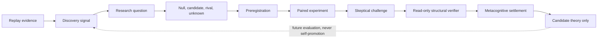

# Constitutional Intelligence Research Engine

Status: `W3_REPLAY_VALIDATED_CANDIDATE_THEORY_ONLY`  
Machine contracts: `intelligence-research-mission.schema.json`, `intelligence-research-settlement.schema.json`  
Decision: ADR-072

## Mission

The Constitutional Intelligence Research Engine (CIRE) is nimrod's cross-domain scientific layer for discovering better ways of discovering. It does not optimize answers directly. It discovers, preregisters, tests, challenges, and retains candidate methods for reasoning, research, creativity, planning, evaluation, memory, and problem solving.

Security is the first replay domain, not the engine's permanent subject. Software, science, planning, and general reasoning can become later experimental domains only through their own evidence contracts.

CIRE is not a sovereign agent, authorization plane, self-modifying model, or promotion authority. The Constitutional Kernel remains above it. Its strongest autonomous output is a content-addressed candidate theory.

## Scientific loop

Every loop preserves the null hypothesis, rival explanations, material unknowns, counter-evidence, falsifiers, scope, missing evaluation, and authority ceiling. A larger score cannot average away a hard failure.

## Seven research pillars

| Pillar | Machine responsibility | Constitutional output |
|---|---|---|
| Discovery | Find contradictions, repeated failures, missing capabilities, and unasked questions | Opportunity record |
| Research | Convert an opportunity into falsifiable competing hypotheses and a preregistration | Research mission |
| Creativity | Apply explicit analogy, inversion, morphological search, cross-domain transfer, counterfactual, and first-principles operators | Candidate method |
| Problem solving | Compare multiple ordered strategies over the same bounded cases | Paired method results |
| Scientific method | Bind predictions, metrics, challenges, replication needs, and stopping conditions before settlement | Evidence ledger |
| Recursive improvement | Study reasoning, planning, memory, search, evaluation, and discovery methods without changing the active baseline | Candidate theory or candidate genome input |
| Theory | Store conditional, scoped, falsifiable explanations instead of isolated successful prompts | Candidate-only theory |

## Cognitive world model

CIRE's future world model is a typed graph of knowledge, problems, hypotheses, theories, failures, capabilities, unknowns, opportunities, and research programs. W3 does not claim this global graph exists. It implements one content-addressed local research graph containing one opportunity, one question, four competing hypotheses, two methods, two replay cases, four paired results, three predictions, six skeptical challenges, one metacognitive settlement, and one candidate theory.

## W3 experiment

The first experiment asks whether uncertainty-first adversarial decomposition provides a structural advantage over retrieval-first planning for evidence-incomplete investigation.

The baseline is `retrieve -> synthesize -> decide`. The candidate is `represent uncertainty -> decompose -> adversarial challenge -> counterfactual -> retrieve -> synthesize -> abstain or decide`.

Both methods run against credential-theft and suspicious-script replay structures backed by their distinct W2 lifecycle receipts. The engine measures required-operation coverage, uncertainty preservation, challenge coverage, evidence efficiency, and complexity cost. It computes a preregistered mean coverage delta of `0.633333`, preserves abstention, and remains within the four-operator observed complexity delta against a ceiling of five.

This is evidence about method structure, not evidence of superior general intelligence or real-world security outcomes. Only two replay fixtures exist. There is no hidden, private, external, forward, or production evaluation.

## Settlement

The read-only verifier independently recomputes source binding, result digests, the paired matrix, aggregate metrics, preregistered predictions, challenge preservation, and the candidate-only theory ceiling in a separately launched operating-system process. Its environment is allowlisted and excludes credential-like variables. A dedicated OS account, production custody, and production independence remain explicitly unproven.

The settlement remains `partially_known`. It must investigate further and abstain from generalization. The candidate theory contains explicit falsifiers and cannot authorize, execute, change policy, contact a target, use credentials, verify itself, promote itself, or modify the constitution.

## Research ladder

The long-range research catalog studies eight subjects: bounded problem solving; better problem solving; research; creativity; reasoning; improvement; discovery; and how intelligence evolution is evaluated.

This is a catalog of experimental subjects, not an authority ladder. Every subject remains candidate-only. CACIS's existing recursive levels and Evolution Foundry gates remain controlling; the two frontier subjects cannot enter an active lineage until a later versioned contract defines their evaluation and governance.

## Honest limits

W3 uses deterministic local replay and static structural metrics. It performs no model call, network access, live sensing, target contact, execution, real external replication, hidden future evaluation, theory promotion, runtime self-modification, or production verification. It does not establish that the candidate method improves task accuracy, creativity, safety, or general intelligence.

## Next evidence gates

1. Move the verifier to a dedicated OS identity and separately administered production custody boundary.
2. Replace replay-labeled W5 private/external partitions with genuinely sealed evaluators and forward evidence.
3. Measure real task outcomes, calibration, latency, resource cost, and failure modes instead of structural coverage alone.
4. Preserve W5 output as candidate-only until external replication and owner-controlled promotion review exist.
