# nimrod Crucible

Status: `SPECIFICATION_ONLY_NO_EXECUTION`  
Product role: governed continuous security validation and causal assurance  
Deployment default: customer-controlled hybrid  
Production effect ceiling: safe realism

## Product definition

nimrod Crucible continuously validates whether a protected environment can prevent, observe, detect, explain, contain, and recover from authorized adversary behavior. It coordinates external Red, Blue, and Purple platforms through signed capability-limited connectors while keeping authority, target scope, evidence, and abort control in a separate deterministic core.

Authorized offensive testing is a required product capability because defensive claims cannot be established from passive telemetry alone. The requirement is satisfied through governed adversary emulation and measured causal evidence, never through unrestricted execution or targets outside a verified authorization lease.

Crucible is not a C2 framework, exploit platform, malware builder, SIEM, EDR, or replacement for human authorization. It is the evidence and authority fabric that makes those tools interoperable, measurable, controllable, and recoverable.

## Operating architecture

```mermaid
flowchart LR
    Owner["Customer authority"] --> Lease["Authorization Lease Broker"]
    Lease --> Compiler["Campaign Compiler"]
    Compiler --> Red["Isolated Red Adapter Zone"]
    Red --> Target["Authorized target or twin"]
    Target --> Blue["Blue Telemetry Connectors"]
    Blue --> Normalize["OCSF Normalizer"]
    Normalize --> Correlate["Causal Correlator"]
    Correlate --> Graph["Attack-Defense-Repair Graph"]
    Graph --> Witness["nimrod Witness"]
    Graph --> Forge["Improvement Forge"]
    Forge --> Sealed["Sealed Evaluation"]
    Sealed --> Canary["Shadow and Canary"]
    Canary --> Promote["Independent Promotion Authority"]
    Kill["Out-of-band Kill Switch"] --> Lease
    Verify["Independent Cleanup and Recovery Verifier"] --> Witness
    Target --> Verify
```



### Authority Lease Broker

The broker accepts only a signed `AuthorizationLease` with:

- customer and approver identities;
- proof-of-authority reference;
- immutable target graph with stable bindings;
- allowed ATT&CK/ATLAS techniques and connector capabilities;
- prohibited actions and safe-realism effect ceiling;
- campaign start, expiry, and maximum duration;
- action, concurrency, cost, data, and blast-radius budgets;
- required preflight recovery evidence;
- customer-controlled revocation and kill-switch channels;
- cleanup and post-state verification contracts.

Discovery may reduce the target set or create a proposed amendment. It cannot enlarge an active lease.

### Campaign Compiler

The compiler accepts ATT&CK/ATLAS mappings, CACAO playbooks, Atomic definitions, Caldera abilities, tool plans, and human objectives only as untrusted source material. It emits a deterministic `ValidationCampaign` containing typed steps and exact connector capabilities. Unknown commands, ambiguous targets, missing cleanup, unsupported effects, or unbounded variables are rejected.

The current fixture-only implementation parses local Atomic and Caldera YAML under a 64 KiB cap, rejects unsafe YAML constructs and duplicate keys, hashes then discards command/cleanup text, and requires an exact source-artifact policy mapping. It emits only the existing simulated no-op connector/capability and cannot contact either source tool. A successor range execution gate threshold-signs that non-provisioning capability declaration, compiles one cryptographically authorized lease target into one declared topology binding, and requires nine real-environment attestations. The packet remains blocked with zero real attestations. This is compiler and evidence-gate proof, not isolated-range or tool-operation evidence.

### Isolated Red Adapter Zone

Red connectors run outside the trusted core with separate identities, networks, secrets, logs, and resource budgets. The zone exposes no generic command endpoint. Every connector supports only:

```text
discover → preflight → compile → execute → observe → abort → cleanup → verify
```

The egress proxy permits only leased targets and approved supporting infrastructure. A compromised Red tool cannot reach policy, signing, Witness mutation, sealed tests, other tenants, or non-target networks.

### Blue Telemetry Connectors

Blue connectors are read-only by default. They ingest endpoint, network, identity, application, cloud, AI-agent, and recovery evidence. Active-response capabilities require a separate executor manifest and authorization class.

### Causal Correlator

Correlation uses trusted time bounds, target identity, process/resource lineage, campaign step identity, sensor provenance, rule version, and independent post-state evidence. It distinguishes:

- action not attempted;
- action attempted but ineffective;
- action effective but unobserved;
- telemetry present but not normalized;
- normalized evidence present but no detection;
- detection present but no useful response;
- response attempted but ineffective;
- recovery incomplete or unverified;
- fully verified outcome.

An alert timestamp near an emulation step is not proof of causation.

## Interoperability stack

| Layer | Initial connectors | Contract posture |
|---|---|---|
| Red/Purple range | Atomic Red Team, MITRE Caldera | First implementation; structured tests and operations compile into bounded steps |
| Red C2 | Mythic, Sliver | Later isolated-range gate; no bundled payloads or generic C2 proxy |
| Blue endpoint/SIEM | Wazuh, Velociraptor | Read-only evidence first; active response separately gated |
| Analytics | Elastic Security, OpenSearch | Query and evidence connectors; storage remains customer-controlled |
| Identity graph | BloodHound CE | Read-only imported graph with freshness and source labels |
| Purple reporting | VECTR | Import/export connector; nimrod causal verdict remains authoritative only for nimrod evidence |
| Commercial | Cobalt Strike, Brute Ratel, Splunk, CrowdStrike, Scythe, AttackIQ | Customer-managed connectors after license, API, and safety review |

Every connector manifest declares product/version compatibility, API identity, permissions, target binding, data fields, network destinations, secrets, side effects, idempotency, abort semantics, cleanup, rate limits, licensing, and health checks. Vendor-specific JSON is retained by digest while normalized events use OCSF-compatible semantics.

## Assurance Vector

Crucible reports a vector for each target, control, technique, campaign, and time window:

| Dimension | Meaning |
|---|---|
| Prevention | The technique was denied before its intended state delta |
| Observation | Required sensors captured the relevant state and lineage |
| Detection | A rule or analytic produced a correctly scoped finding |
| Correlation | The finding was causally tied to the campaign step |
| Response | The authorized response reached its declared postcondition |
| Recovery | The target returned to an independently verified state |
| Precision | Matched negative controls did not create false findings |
| Evidence completeness | Required sources, timestamps, lineage, and receipts are present |
| Privacy | Collection and disclosure stayed inside the approved minimum |
| Performance | Resource and user-workflow impact stayed within budget |
| Uncertainty | Contradictions, missing or stale evidence, and oracle limitations |
| Freshness | Time since the exact control/technique/environment combination was revalidated |

Assurance decays when software, policies, models, connectors, topology, identity relationships, or evidence age change. No universal percentage or permanent PASS is permitted.

## Recursive Improvement Forge

The forge is a clean-room nimrod design. It does not copy private ObtuseAI source or operating logic.

1. Quarantine every imported rule, playbook, trace, report, model output, and external candidate.
2. Hash, deduplicate, license-check, secret-scan, provenance-label, and risk-score the material.
3. Create replay fixtures and explicit contradicting cases.
4. Generate four bounded candidates through precision, systems, adversarial, and synthesis lenses.
5. Score evidence, validation, reversibility, simplicity, risk control, useful novelty, learning value, and prior outcomes.
6. Preserve diverse elites per mutation family and a best-ever champion floor.
7. Cool down repeatedly rejected non-protected branches; validation and rollback families never cool down.
8. Evaluate public regression, sealed holdout, poisoning, privacy, performance, cleanup, and recovery suites.
9. Shadow and canary eligible candidates under a lower or equal authority tier.
10. Promote through an independent signer or create a threshold-human approval packet.
11. Automatically demote when guardrails, calibration, recovery, or user harm regress.

The forge cannot view sealed answers, edit its evaluator, lower thresholds, choose its promotion signer, erase failures, access production keys, or increase an authority class.

The selected separated Constitutional Evolution Foundry implements this boundary in the no-execution reference: signed Constitution, immutable candidate artifacts, typed epistemic posture, threshold-pinned evaluator identities, individually signed observations, threshold-certified isolation attestations, lineage-wide resource accounting, lexicographic evaluation, capability-triggered safeguard escalation, threshold-signed shadow registration, and signed demotion across three distinct worker processes. The maximum transition is shadow registration; no candidate is executed and the active baseline is never modified. Fixture-origin isolation evidence can establish contract behavior only and cannot authorize live or production use.

## Production safety

Ordinary production campaigns may use real authorized techniques only when the expected effect is bounded and reversible. The following effects are twin-or-sacrificial-replica only:

- destructive file or database loss;
- ransomware encryption impact;
- real secret or customer-data exfiltration;
- firmware, bootloader, or hardware-root modification;
- uncontrolled persistence or propagation;
- physical, medical, automotive, aviation, industrial, or life-safety actuation;
- actions whose cleanup and recovery oracle have not been proven.

The kill switch is outside the orchestration dependency chain. Lease revocation prevents new actions, invalidates connector capabilities, closes campaign routes, and begins cleanup verification.

## Release sequence

1. `NO_EXECUTION_SIMULATOR`: schemas, campaign compiler, causal graph, fixtures, twin, no-op connectors.
2. `ISOLATED_RANGE_ALPHA`: Atomic, Caldera, Wazuh, Velociraptor, VECTR, OCSF normalization.
3. `C2_RANGE_BETA`: Mythic/Sliver isolation, compromise tests, egress proof, kill-switch proof.
4. `AUTHORIZED_PRODUCTION_PRIVATE_BETA`: safe-realism campaigns with design partners.
5. `ENTERPRISE_GA`: independently assessed connectors, operations, disclosure program, support, and audited release evidence.

Each state is independently gated. No elapsed time or prior Edge release grants Crucible authority.

### Current preparation evidence

The no-execution range-readiness layer now requires a short-lived 2-of-3 signed mapping policy, reconciles a complete local Atomic/Caldera fixture corpus without compiling it, and evaluates nine disposable-range controls. The canonical current result is blocked because the controls have no real environment evidence. A contract-only all-proven fixture demonstrates state-machine behavior but deliberately leaves installation, connection, and execution unauthorized. See `RANGE_READINESS.md` and `RANGE_READINESS_VALIDATION.json`.

The successor lifecycle layer declares the required three-zone topology without provisioning it, consumes a threshold-signed one-way kill command through an atomic durable state slot, and evaluates snapshot plus cleanup evidence. Its contract-only verified recovery cannot disengage the kill or authorize reuse. See `RANGE_LIFECYCLE.md` and `RANGE_LIFECYCLE_VALIDATION.json`.

The range execution gate then binds three independently reviewable documents: a 2-of-3 signed connector capability manifest limited to `compile`, `preflight`, and `verify`; an exact lease-to-topology scope with one target, capability, kill-switch, and budget binding; and a pre-execution packet requiring nine fresh real attestations. Simulated controls cannot become verified evidence. The gate has no connector runtime, endpoint, credential, installation, provisioning, discovery, connection, or execute operation. See `RANGE_EXECUTION_GATE.md` and `RANGE_EXECUTION_GATE_VALIDATION.json`.

The evidence-admission successor separates collection governance from verification. A second short-lived 2-of-3 policy pins one unique read-only collector per control and retains signed raw bytes by digest. A third acceptance boundary separately governs verifier decisions without collapsing reject, abstain, disagreement, or timeout. A fourth completion boundary requires another 2-of-3 policy and authorization to mark nine real accepted controls complete. The canonical authorization is an explicit denial. Even a successful real-shaped completion receipt fixes connection and execution false. See `RANGE_EVIDENCE_ADMISSION.md`, `RANGE_EVIDENCE_ACCEPTANCE.md`, `RANGE_EVIDENCE_COMPLETION.md`, and their validation reports.

The public sacrificial-source boundary pins five intentionally vulnerable repositories as metadata-only inputs for later owner-controlled offline replicas. It denies owner scope, unknown ownership, public hosts, maintainers, GitHub services, registries, demos, and third-party deployments. No source content, dependency, image, replica, network, or campaign was used. See `PUBLIC_SACRIFICIAL_CORPUS.md` and `PUBLIC_SACRIFICIAL_CORPUS_VALIDATION.json`.

The source-staging successor binds that corpus to an explicit incomplete owner registry and a 2-of-3 signed denial. All five sources are requested but none is authorized or staged; all eight provenance, integrity, license, secret, malware, reproducibility, and SBOM checks remain pending. Valid governance signatures cannot substitute for owner attestation. See `SOURCE_STAGING_GATE.md` and `SOURCE_STAGING_GATE_VALIDATION.json`.

The construction-zone preflight then declares ten mandatory isolation controls and eight quarantine evidence results without provisioning the zone. All ten controls remain unproven, all eight results remain missing, and zero archives exist. The deterministic gate rejects 40 attempts to launder declarations into enforcement, evidence, staging, build, connection, execution, or self-authorization. See `CONSTRUCTION_ZONE_PREFLIGHT.md` and `CONSTRUCTION_ZONE_PREFLIGHT_VALIDATION.json`.

The provisioning successor assigns a control-specific evidence contract to every isolation control and requires live observations from distinct collector and verifier principals and processes. The canonical plan has no assigned observers or evidence, and a separate 2-of-3 decision explicitly denies provisioning with no provider, approval, credentials, infrastructure, staging, build, connection, or execution authority. See `CONSTRUCTION_ZONE_PROVISIONING_GATE.md` and `CONSTRUCTION_ZONE_PROVISIONING_GATE_VALIDATION.json`.
