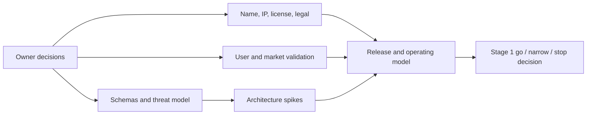

# Phase 0 backlog

Objective: convert the approved foundation into validated product, legal, architecture, and delivery decisions without deploying privileged security software.

Priority meanings: P0 blocks Stage 1; P1 blocks alpha; P2 is useful but not a current blocker.

## Epic 0 — Owner decisions

| ID | Pri | Deliverable | Acceptance evidence |
|---|---:|---|---|
| nim-001 | P0 | Approve/change initial Windows-first wedge | Signed decision with target user, platform, use cases, non-targets |
| nim-002 | P0 | Select initial customer and design-partner profile | Screening criteria and recruitment list |
| nim-003 | P0 | Approve doctrine | Versioned owner approval; rejected/changed clauses recorded |
| nim-004 | P0 | Approve Stage 0 budget and accountable leads | Named owners, decision rights, funding ceiling |

Current evidence:

- `nim-001` is accepted through ADR-002 and ADR-016: the first product remains Windows-first Edge Preview within the separately gated Edge/Crucible platform.
- `nim-003` is accepted through ADR-068: doctrine v0.1 is owner-approved and changes remain governed by its change protocol.
- `nim-002` remains open because a named design-partner profile and recruitment list have not been selected.
- `nim-004` remains open because accountable leads, decision rights, and the Stage 0 funding ceiling have not been named.
- `nim-021` is accepted through ADR-001 and ADR-021: trademark clearance remains paused and lowercase `nimrod` remains private/internal.
- `nim-022` is accepted through ADR-009 and ADR-024 plus the verified private `ObtuseAI/nimrod` repository; customer terms and external distribution remain separately blocked.

## Epic 1 — Market and product validation

| ID | Pri | Deliverable | Acceptance evidence |
|---|---:|---|---|
| nim-010 | P0 | 20 structured discovery interviews | Notes, coded pain themes, counter-evidence, no leading concept pitch |
| nim-011 | P0 | Competitive alternatives map | Current EDR, personal security, network, recovery, and agent-security alternatives; buy/build/do-nothing |
| nim-012 | P0 | Installation and trust-risk study | Measured willingness to grant privileges and reasons for rejection |
| nim-013 | P0 | Explanation/proof UX prototype | Five moderated tests with non-expert and technical users |
| nim-014 | P0 | Design-partner cohort | 5–8 written evaluation intents with environment diversity |
| nim-015 | P1 | Pricing and packaging experiments | Evidence for free preview and sustainable paid model; no surveillance revenue |

## Epic 2 — Corporate, name, IP, and legal

| ID | Pri | Deliverable | Acceptance evidence |
|---|---:|---|---|
| nim-020 | P0 | Entity and IP ownership foundation | Counsel-confirmed entity, assignments, contractor terms |
| nim-021 | P0 | Private-name and external-identity boundary | Owner decision records trademark pause; release automation rejects external artifacts branded nimrod until a separately approved identity exists |
| nim-022 | P0 | Private repository and distribution policy | Private `obtuseai` visibility/access proof, no-license notice, third-party intake policy, and separately gated customer terms |
| nim-023 | P0 | Preliminary patent/FTO triage | Counsel memo on publication timing and highest-value candidate claims |
| nim-024 | P0 | Privacy and product-liability applicability memo | Initial data/use/jurisdiction assumptions and prohibited claims |
| nim-025 | P0 | Encryption export classification plan | Counsel/qualified classification path before public access |
| nim-026 | P1 | Terms, privacy, acceptable-use, disclosure outline | Drafts mapped to actual product behavior, not generic templates |

## Epic 3 — Specifications and conformance

| ID | Pri | Deliverable | Acceptance evidence |
|---|---:|---|---|
| nim-030 | P0 | Action/evidence envelope v0.1 | JSON Schema plus canonical examples and negative cases |
| nim-031 | P0 | Evidence receipt v0.1 | Schema, evidence classes, chain-of-custody rules |
| nim-032 | P0 | Principal/capability schema | Actor identity, audience, purpose, resource, expiry, delegation rules |
| nim-033 | P0 | Policy decision schema | Outcomes, rule trace, approvals, denial reason, version hash |
| nim-034 | P0 | Verification result schema | Full/partial/failed/timeout/contradicted/unknown semantics |
| nim-035 | P0 | Plugin manifest and trust model | Signed permissions, compatibility, data access, network destinations |
| nim-036 | P0 | Update metadata and rollback contract | Roles, thresholds, expiry, anti-rollback, offline verification |
| nim-037 | P0 | Conformance harness | Two independent encoders/decoders pass positive and negative corpus |

## Epic 4 — Architecture spikes

| ID | Pri | Deliverable | Acceptance evidence |
|---|---:|---|---|
| nim-040 | P0 | Windows supported-API feasibility matrix | Process, provenance, file, DNS/flow, suspend/terminate, egress, snapshot APIs and gaps |
| nim-041 | P0 | Authority boundary prototype | Analytics compromise cannot call no-op executor without issued capability |
| nim-042 | P0 | Local Witness prototype | Crash-safe append, replay, tamper detection, compaction/retention experiment |
| nim-043 | P0 | Independent verification spike | Success-return/no-state-change and stale-read cases stay non-success |
| nim-044 | P0 | Plugin sandbox spike | WASM capability/egress/CPU/memory constraints and escape test |
| nim-045 | P0 | Update-system design spike | Threshold roles, offline verification, freeze, rollback, key-loss recovery |
| nim-046 | P1 | Local model privacy/performance spike | No authority; measured data exposure, latency, memory, and adversarial behavior |

## Epic 5 — Security and privacy program

| ID | Pri | Deliverable | Acceptance evidence |
|---|---:|---|---|
| nim-050 | P0 | Independent threat-model workshop | Findings, changed assumptions, owners, residual risks |
| nim-051 | P0 | Field-level data inventory template | Approved purpose, classification, retention, access, provider, deletion fields |
| nim-052 | P0 | Secure development standard | SSDF mapping, language/dependency rules, review and test requirements |
| nim-053 | P0 | Release and signing ceremony | Rehearsed identities, thresholds, offline recovery, evidence |
| nim-054 | P0 | Vulnerability response design | Private intake, SLA targets, severity, disclosure, customer notice, safe harbor |
| nim-055 | P1 | Adversarial evaluation plan | Hostile content, evidence, executor, update, privacy, availability campaigns |
| nim-056 | P1 | Assurance vendor shortlist | Privileged-code review, penetration test, accessibility, privacy options |

## Epic 6 — Delivery and operations foundation

| ID | Pri | Deliverable | Acceptance evidence |
|---|---:|---|---|
| nim-060 | P0 | Repository and CI architecture | Protected paths, identity, branch/review model, artifact retention |
| nim-061 | P0 | Dependency and artifact policy | Pinning, review, license, provenance, SBOM, quarantine process |
| nim-062 | P0 | Environment and secret model | No shared developer production credentials; rotation and break-glass |
| nim-063 | P1 | Incident and rollback playbooks | Tabletop results for malicious update, key compromise, privacy incident, outage |
| nim-064 | P1 | Support and evidence-access design | User-visible, expiring access; no silent remote administration |
| nim-065 | P1 | Product EOL and company-failure plan | Offline continuity, safe uninstall, export, update cessation, key stewardship |

## Epic 7 — Crucible and universal AI assurance

| ID | Pri | Deliverable | Acceptance evidence |
|---|---:|---|---|
| nim-070 | P0 | Protection Profile v0.1 conformance corpus | Positive and negative profiles for range, production, AI, and unsupported safety domains |
| nim-071 | P0 | Connector Manifest v0.1 and no-op adapter | Closed lifecycle proven; no generic command or pass-through API |
| nim-072 | P0 | Authorization Lease v0.1 | Forgery, replay, expiry, revocation, target substitution, and discovery-expansion tests fail closed |
| nim-073 | P0 | Validation Campaign compiler | CACAO/Atomic/Caldera fixtures compile only into allowlisted typed steps |
| nim-074 | P0 | Causal Coverage Verdict and Assurance Vector | Positive/negative controls distinguish action, observation, normalization, detection, response, and recovery gaps |
| nim-075 | P0 | Counterfactual Coverage Twin | Destructive/exfiltration/safety effects remain simulated with predicted evidence and rollback |
| nim-076 | P0 | Customer-controlled kill-switch prototype | Revocation works without orchestrator, model, or vendor connector availability |
| nim-077 | P0 | Recursive Improvement Candidate contract | Tiered promotion, sealed evaluation, champion floor, canary, demotion, and durable failure evidence |
| nim-078 | P0 | AI Capsule state and repair contract | Prompt, policy, model, memory, retrieval, tool, lease, snapshot, and verifier state are versioned |
| nim-079 | P1 | Open-source range connector plan | Atomic, Caldera, Wazuh, Velociraptor, VECTR, OCSF, and read-only BloodHound compatibility matrices |
| nim-080 | P1 | C2 isolation safety case | Mythic/Sliver compromise, egress, delayed callback, cleanup, credential, and kill-switch tests |
| nim-081 | P1 | Authorized-production legal and operations case | Counsel, insurance, customer proof-of-authority, incident, and emergency communication approval |
| nim-082 | P0 | Threshold-signed range adapter policy | 2-of-3 role-diverse signatures, exact digests, freshness, and authority-widening denial |
| nim-083 | P0 | Read-only local corpus compatibility scanner | Exact complete file set, identity/digest/mapping checks, and proof of no fetch/compile/network/execute activity |
| nim-084 | P0 | Disposable-range preflight gate | Nine fresh evidence-backed controls; satisfied gate still cannot authorize installation, connection, or execution |
| nim-085 | P0 | Declaration-only disposable topology | Three exact zones/nodes, two one-way routes, unique credentials, default deny, and no provisioning authority |
| nim-086 | P0 | Out-of-band kill/revocation state | Threshold-signed one-way engagement, atomic publication, crash persistence, replay/conflict denial, and no reset operation |
| nim-087 | P0 | Snapshot and cleanup verification receipt | Exact topology/kill binding, six obligations, two distinct verifiers, snapshot equality, and reuse authority fixed false |
| nim-088 | P0 | Evolution Constitution and epistemic contracts | Threshold signatures, 20 exact axioms, typed claims, hard failures, capability triggers, tier ceilings, and resource budgets |
| nim-089 | P0 | Separated candidate Foundry and evaluator | Immutable baseline, digest-only candidates, CAS provenance, four evaluator roles, eight hard gates, five champion floors, and no aggregate score |
| nim-090 | P0 | Shadow transition and demotion state | Threshold signatures, Tier A/B ceiling, atomic publication, crash/replay/conflict proof, signed demotion, and baseline-write false |
| nim-091 | P0 | Evaluator identity and isolation assurance | Threshold-signed trust policy, signed subject-bound observations, seven-control isolation attestations, and fixture/live distinction |
| nim-092 | P0 | Candidate-lineage resource accounting | Threshold-signed hash chain, parent binding, cumulative cycle/compute/memory/storage/child ceilings, and no expansion authority |
| nim-093 | P0 | Evolution Foundry control-board view | Display-only evaluator mesh, isolation state, resource lineage, shadow eligibility, and permanent false promotion/execution controls |
| nim-094 | P0 | Read-only Windows isolation collector | Separate process records executable, SID, credential-key categories, ACL descriptors, and firewall configuration; emits signed live evidence with exact blockers and performs no mutation or active probe |
| nim-095 | P0 | Independent evaluator conformance implementation | Strict TypeScript/Node verifier independently implements canonical JSON, Ed25519, governance quorum, envelope, isolation, and resource-chain semantics and rejects eight adversarial bundles |
| nim-096 | P0 | Durable Windows resource meter | Job Object memory ceiling and kill-on-close, live CPU/memory/storage/I/O evidence, immutable records, separate-process abrupt-crash recovery, signed lineage binding, and suspended-before-resume assignment; physical power-loss durability remains blocked |
| nim-097 | P0 | Windows effective-access and target-egress preflight | Read-only DACL effective rights for target/collector identities and exact executable firewall-rule inspection; no ACL, firewall, or network mutation |
| nim-098 | P0 | Read-only hardware-custody readiness | Enumerate CNG providers and TPM management state without key creation, signing, private-material access, or production authorization; preserve hardware-key, attestation, and human-custody blockers |
| nim-099 | P0 | Physical power-loss durability campaign | Operator-approved sacrificial-host power interruption, journal recovery, storage-cache evidence, independent observation, and repeatability criteria; not performed in the reference environment |
| nim-100 | P0 | Threshold-signed non-provisioning connector capability manifest | Exact source/governance binding, 2-of-3 signatures, compile/preflight/verify-only operations, empty destinations/secrets, and immutable false installation/connection/execution authority |
| nim-101 | P0 | Lease-to-topology scope compiler | Cryptographically verified lease, one exact Windows range target, capability intersection, topology/kill/budget binding, and production/multi-target/widening denial |
| nim-102 | P0 | Pre-execution real-environment evidence packet | Nine exact fresh controls, non-simulated content-addressed proof and independent verifier identity required, simulated evidence cannot verify, and connection/execution remains false |
| nim-103 | P0 | Read-only sacrificial-range attestation collectors | Owner-named environment, connector-neutral read-only observations, independent collector identities, raw evidence retention, and no provisioning, policy mutation, credential handling, tool installation, connection, or execution |
| nim-104 | P0 | Independent range-evidence verifier acceptance | Implemented: threshold-signed verifier policy, three distinct identities, 18 signed decisions over nine retained observations, five preserved resolution states, simulated-acceptance denial, and 46 adversarial cases; no collection, connection, evidence-completion, or execution authority |
| nim-105 | P0 | Separate range evidence-completion authority | Implemented: threshold-signed policy and authorization, exact nine-control acceptance binding, explicit fixture denial, deterministic receipt, successful real-shaped completion without connection/execution authority, and 36 adversarial cases |
| nim-106 | P0 | Governed public sacrificial source corpus | Implemented: five exact public source revisions and license records, incomplete owner exclusion registry with unknown-ownership denial, offline replica declarations, immutable public-target denial, and 38 adversarial cases; no content download, build, connection, or execution |
| nim-107 | P0 | Owner-bound source staging gate | Implemented: explicit incomplete owner-scope registry, 2-of-3 signed staging denial bound to all source and replica metadata, eight mandatory quarantine controls, offline network declaration, and 36 adversarial cases; zero authorized or staged sources |
| nim-108 | P0 | Construction-zone and quarantine evidence preflight | Implemented: declaration-only ten-control isolation contract, eight-result quarantine receipt, deterministic blocked decision, and 40 adversarial cases; zero controls verified, zero quarantine evidence, zero archives, and no provisioning authority |
| nim-109 | P0 | Operator-owned construction-zone provisioning gate | Implemented: ten-control live attestation plan requiring distinct collector/verifier principals and processes, 2-of-3 signed provisioning denial, zero assigned observers, and 55 adversarial cases; no provider, approval, credentials, infrastructure, or operational authority |
| nim-110 | P0 | Caller-scoped Edge live observation adapter | Implemented: one real benign Windows process measured through six supported read-only interfaces, hashed identity only, seven fail-closed cases, and explicit policy/action blockers |
| nim-111 | P0 | Signed release and plugin trust foundation | Implemented: two-role Ed25519 verification, exact anti-rollback predecessor binding, artifact/provenance/SBOM and rollback contract, deny-by-default WASM manifest, and twelve adversarial denials; no installation or plugin execution |
| nim-112 | P0 | Edge design-partner evidence kit | Implemented: 5–8 cohort plan, five comprehension/privacy tasks, consent-first data boundary, eight adversarial denials, and literal zero-participant recruitment-not-started state |
| nim-113 | P0 | CACIS vNext constitutional spine | Implemented contract-only: owner brief, ADR-069, federated immune-plane hardening portfolio, eight-wave roadmap schema/example, 18 semantic denials, and explicit no-authority state |
| nim-114 | P0 | CACIS W1 immutable World Model replay | Implemented replay-only: eight observations, six domains, deterministic derived generation, contradiction/staleness/unknown preservation, atomic head, prepared-crash recovery, and 26 adversarial denials |
| nim-115 | P0 | CACIS W2 ephemeral Immune Runtime replay | Implemented replay-only: eight leased cells, 15 chained events, seven typed contributions, one abstention, Shadow termination, complete disposal, three candidate-only retained records, and 49 adversarial denials |
| nim-116 | P0 | CACIS W3 Constitutional Intelligence Research Engine and Hypothesis Cortex | Implemented replay-only: one discovery opportunity, four competing hypotheses, two cognitive methods, two paired cases, six skeptical challenges, logical read-only structural verification, metacognitive abstention, one candidate-only theory, and 71 adversarial denials |
| nim-117 | P0 | CACIS W4 metabolism, homeostasis, and Chronos | Implemented replay-only: nine resource dimensions, thirteen signals, seven domain clocks, six work items, three bounded schedule proposals, one backpressure deferral, two expiry abstentions, and 60 adversarial denials |

Current implementation evidence: the Windows-first Edge reference runs one offline replay through Budget-1 policy and a separate live read-only process-identity adapter. The live path is caller-scoped, hashed, non-enumerating, and explicitly cannot produce an egress decision or action. Signed release verification now binds governance, predecessor sequence, artifact, provenance, SBOM, rollback, and a deny-by-default plugin manifest while preserving zero installation and execution. The design-partner plan preserves zero participants, contact, consent, installations, collection, and external messages until named partners and privacy review exist. The no-execution Crucible, range-denial, and candidate-only evolution boundaries remain unchanged. Continuous endpoint sensing, publisher/destination correlation, containment, production custody, actual rollout and rollback, enforced plugin runtime isolation, real design-partner evidence, and live/range offensive evidence remain incomplete.

CACIS vNext is decision-recorded; W1 implements an offline replay-only World Model reducer and immutable local generation store, and W2 implements a replay-only ephemeral organism lifecycle. Continuous sensing, multi-generation federation, production organism isolation, independent settlement, policy consumption, and operational effects remain evidence-gated successor waves.

## Phase 0 critical path

## Phase 0 exit review

The review must choose exactly one:

- `GO_STAGE_1_UNPRIVILEGED_PROOF`
- `NARROW_AND_REPEAT_PHASE_0`
- `PIVOT_PRODUCT_WEDGE`
- `STOP_INSUFFICIENT_VALUE_OR_SAFETY`

Silence, elapsed time, or completed documents cannot produce a go decision.
