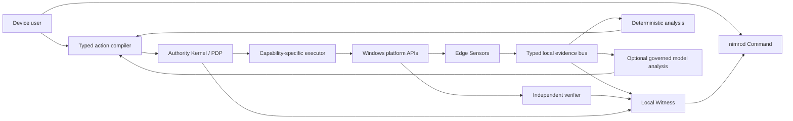

# nimrod reference architecture

Status: proposed baseline  
Architecture rule: analytics proposes; deterministic policy authorizes; narrow executors act; independent verifiers measure; Witness records.

## CACIS vNext target architecture

ADR-069 selects a federated constitutional immune plane around this baseline. Immutable observations feed a versioned six-domain World Model; a non-authorizing Governor creates ephemeral capability- and resource-bound organisms; ADR-072's cross-domain Constitutional Intelligence Research Engine turns repeated uncertainty into preregistered competing hypotheses and method experiments; ADR-073 bounds proposal scheduling through nine-dimensional metabolism, thirteen-signal homeostasis, and seven domain clocks; adversarial and metacognitive challenge preserves dissent; independent settlement verifies claims and recovery; governed memory can emit only candidate genomes into the existing Foundry; and the Observatory consumes signed display-only projections.

The current architecture below remains the authority and effect path. CACIS does not create a new executor edge, does not let the Governor authorize, does not let an organism or candidate self-verify, and does not bypass Crucible authorization or isolated-range gates. `VNEXT_CACIS_MASTER_PLAN.md` defines the eight-wave target and `cacis-capability-roadmap.schema.json` makes those ceilings machine-verifiable.

W1 implements the first replay-only plane. Eight typed observations are stored by canonical digest; a pure reducer derives one content-addressed generation in canonical identity, endpoint, network, cloud, threat, and recovery order; and an atomic head makes a prepared generation active only after every artifact exists. Recovery treats a prepared head as uncommitted. Contradictory candidates, stale evidence, explicit unknowns, provenance, and missing requirements remain visible. The generation has no policy, authorization, execution, target-contact, or production-truth edge.

W2 adds one replay-only Immune Runtime around that generation. A deterministic non-authorizing Governor schedules eight unique capability-bound cells under separate time and resource leases. One Shadow pauses on contradiction, resumes without selecting truth, forces abstention for missing recovery evidence, and terminates at the typed-proposal ceiling. The digest-linked receipt proves all cells terminated, leases revoked, scratch and conversational context destroyed, and only three candidate-only typed knowledge records retained. Independent verification remains required and unperformed; there is no credential, target, policy, execution, or production edge.

W3 adds replay-only constitutional research with competing hypotheses, skeptical challenge, metacognitive abstention, and a candidate-only theory. W4 consumes that settlement as source evidence and emits only bounded schedule proposals. Resource backpressure remains a first-class defer state; expired evidence remains an abstention; confidence inflation and verifier backlog cannot become execution or promotion authority.

## Initial product context



The model path has no direct edge to policy data, executor credentials, Witness mutation, update promotion, or verification state.

## Trust zones

| Zone | Contents | Trust posture |
|---|---|---|
| Z0 Root | bootstrap verifier, trusted keys, anti-rollback state, emergency-disable path | Smallest trusted computing base |
| Z1 Authority | deterministic policy, capability issuer, harm circuit breaker | No model runtime; deny by default |
| Z2 Execution | one connector per consequential capability | Short-lived identity; exact target and expiry |
| Z3 Verification | independent state readers and postcondition checks | Cannot execute the action it verifies for high impact |
| Z4 Evidence | append-only journal, content-addressed artifacts, receipts | No silent mutation or deletion |
| Z5 Analytics | rules, graph correlation, optional models | Untrusted proposer; taint-aware inputs |
| Z6 Experience | local UI and user approvals | Treat rendered external content as hostile |
| Z7 External | OS, cloud, feeds, models, update mirrors, support systems | Authenticated where possible; never implicitly trusted |

## Components

### Bootstrap and Root

- verifies installation and update metadata;
- stores platform-protected device key material;
- enforces anti-rollback and emergency-disable rules;
- exposes attestation evidence without declaring the device globally trusted.

### Edge Sensors

Each sensor is single-purpose and emits a typed observation. Sensors do not decide policy or write durable conclusions. Initial sensors cover:

- process creation and ancestry;
- executable identity and provenance;
- selected file changes;
- DNS and connection metadata correlated to process where supported;
- local nimrod health and update state.

### Evidence Bus

The bus provides schema validation, sequence identity, replay, backpressure, sensitivity labeling, and explicit live/replayed/simulated origin. It is not a general command bus.

### Analysis

Deterministic rules and optional model providers create hypotheses with supporting evidence, contradicting evidence, alternatives, and calibrated uncertainty. All retrieved material remains tainted as data.

### Action Compiler

Converts a user request or analytic proposal into a versioned action envelope. It rejects unknown operations, ambiguous targets, unsupported rollback, missing expiry, excessive resource limits, and prohibited side effects.

### Authority Kernel

Applies deterministic policy to authenticated principals and validated envelopes. It returns one typed decision and a rule trace. It holds no general-purpose content parser and cannot call a model.

### Executors

Each executor implements one capability. Initial candidates:

- `endpoint.process.suspend`
- `endpoint.process.terminate_tree`
- `endpoint.network.restrict_process`
- `endpoint.policy.restore_supported_snapshot`

Executors receive expiring capability tokens and reject target widening. Adding an executor is an authority expansion and requires its own abuse-case and recovery evaluation.

### Independent Verifier

Reads actual post-state through a separate connector or independently structured query. It records full, partial, failed, timed-out, contradicted, and unknown outcomes. It never converts a timeout into success.

The Stage 1 supervised reference runs a JSON-lines verifier in separate OS processes with two logical principals, an allowlisted credential-free environment, and read-only Witness/anchor/trust inputs. The supervisor reconciles signed-subject observations into literal agreed-valid, isolation-unproven, agreed-invalid, disagreement, timeout, and unavailable states. The board verifies threshold-signed, short-lived OS isolation attestations independently of those observations. Production acceptance additionally requires live proof of dedicated OS account/SID, executable identity, credential separation, denied egress, OS-enforced read-only inputs, and separate output ACLs, preferably across separately implemented verifiers; those properties are not established by the desktop harness.

The command UI receives a deterministic verifier projection only through a domain-separated 2-of-3 signed supervisor snapshot. The snapshot binds the projection digest, issuer, board audience, governance state, freshness window, monotonic sequence, and predecessor. A crash-recoverable ingress store accepts exactly the next sequence and exposes a display-only receipt; replay, rollback, gaps, stale/future state, substitution, and durable corruption fail closed. Neither snapshot nor ingress grants authorization or execution authority. Even `agreed_valid` remains a blocked display state when service health and threshold-certified live OS isolation evidence are incomplete.

The Constitutional Evolution Foundry adds another separated chain: an immutable candidate; a threshold-signed evaluator trust policy; four individually signed observations; four threshold-certified isolation attestations; a threshold-signed, hash-chained lineage resource ledger; a lexicographic evaluation; and a threshold-signed shadow transition. The control board projects this chain without owning it. Fixture attestations can establish contract completeness but never live enforcement, and the projection has no promotion, execution, evaluator-selection, or resource-expansion authority.

The deployment-assurance edge now has four additional components. A read-only Windows collector runs outside the measured process and produces live signed observations of process image, token SID, credential-key categories, DACL effective rights, firewall profiles, and exact-executable block rules. A strict TypeScript/Node conformance verifier reimplements canonicalization, Ed25519, quorum, evaluator, isolation, and resource-chain rules without Python verification imports. A Windows Job Object meter creates a benign worker suspended, assigns it before first resume, records actual usage, publishes flushed write-through records, and converts the recovered receipt into a signed lineage entry. A read-only custody collector enumerates CNG providers and TPM management state while permanently denying key creation, signing, private-material access, and production authority. These components expose their incomplete controls to the board; they cannot promote, execute a candidate, mutate host policy, provision custody, or reinterpret partial live evidence as a production-ready boundary.

The Edge product path now adds a narrower caller-scoped adapter over the same supported process-identity APIs. It measures one requested PID, emits only hashed executable/path/account identity, and preserves destination, parent, publisher, and path-classification facts as missing. It is not a continuous sensor and has no policy or action edge. The release path separately verifies a domain-separated threshold-signed candidate, exact predecessor sequence, local artifact bytes, provenance/SBOM references, rollback contract, and complete plugin-manifest set. Plugin manifests target a fuel- and memory-bounded WASI Preview 2 sandbox with no network, filesystem, host-command, process-control, credential, signing, policy, load, or install authority. Contract verification does not load the plugin or install the release.

### Local Witness

Maintains an append-only event journal plus content-addressed evidence objects. Records include schema version, source identity, collection/observation time, integrity hash, classification, transformations, access, retention, and signatures where applicable.

The Stage 1 trust-root extension derives domain-separated SHA-256 Merkle roots from verified journal prefixes. A 2-of-3 governance quorum signs each checkpoint. A separate anchor connector stores content-addressed checkpoints, issues a separately signed receipt and head, and exposes head history. An independent pin store retains a monotonic signed head outside both Witness and anchor roots. This local reference proves contract behavior only; production requires real HSM/KMS custody and an external transparency or mutually witnessed service.

### Command UI

Eight stable views:

1. Protection and coverage gaps.
2. Why this was stopped.
3. Emergency controls.
4. Privacy and data use.
5. Proof and evidence.
6. Signed ingress, verifier health, observations, consensus, dissent, and production boundary.
7. Evolution Foundry evaluator mesh, live-versus-contract isolation evidence, independent conformance, lineage resources, durable-meter state, and shadow-only blockers.
8. Range execution gate showing connector signatures, exact target scope, nine signed collector-observation states, missing independent verification, and immutable false activity/authority.

## Data flow for a consequential action

1. Sensor or user emits an authenticated observation/request.
2. Evidence Bus validates schema and labels origin and sensitivity.
3. Analysis proposes a bounded action or the user selects one.
4. Action Compiler creates an envelope with preconditions, prohibited effects, expiry, rollback, and verification contract.
5. Authority Kernel evaluates deterministic policy and approvals.
6. One executor receives one expiring capability.
7. Executor reports its attempt; this is not success.
8. Independent Verifier reads the actual state and tests postconditions.
9. Witness links observation, decision, attempt, result, and residual uncertainty.
10. UI renders evidence and the safe next action.

## Failure modes

| Failure | Required behavior |
|---|---|
| Sensor unavailable | Mark coverage gap; do not infer normal state |
| Analytics unavailable | Continue supported deterministic/local paths |
| Model compromise | Revoke provider capability; authority and evidence remain intact |
| Policy unavailable | Deny new consequential actions; preserve emergency preauthorized local controls |
| Executor timeout | Verify state; report `inconclusive_timeout` until resolved |
| Verifier unavailable | Action cannot be marked successful |
| Witness unavailable | Deny non-emergency consequential action; emergency action buffers a sealed local receipt |
| Cloud loss | Continue essential local functions and signed offline update checks |
| Update failure | Retain current version or verified rollback; never partial-promote |
| Key compromise suspicion | Freeze promotion, rotate through threshold recovery, publish incident status |

## Crucible extension

Crucible is a separate authority domain sharing schemas, Witness, policy semantics, and verification with Edge. It does not share unrestricted credentials, generic executors, or release authority.

### Crucible trust zones

| Zone | Contents | Required boundary |
|---|---|---|
| C0 Customer authority | authorization signer, target owner, kill switch | Customer controlled and outside orchestration dependencies |
| C1 Lease and campaign compiler | target graph, effect ceiling, budgets, typed steps | Deterministic; no external tool credentials |
| C2 Red adapter zone | Atomic, Caldera, later C2/commercial connectors | Tenant-isolated, leased egress, disposable identities |
| C3 Protected target | authorized range, twin, sacrificial replica, or production target | Stable resource binding and continuous preconditions |
| C4 Blue adapter zone | SIEM, EDR, DFIR, identity, cloud, and AI telemetry connectors | Read-only by default; raw data retained by digest |
| C5 Causal assurance | normalization, expected evidence, causal correlation, negative controls | Cannot execute a campaign or alter raw evidence |
| C6 Improvement Forge | quarantine, replay, candidate tournament, sealed evaluation, canary | Cannot raise authority or modify its evaluator |

### Connector boundary

Before any connector lifecycle exists, external Atomic/Caldera source definitions enter a separate quarantine compiler. The compiler retains only bounded metadata and cryptographic digests, requires an exact fixture-policy mapping, and emits command-free simulated campaigns. Imported target discovery, variables, payloads, commands, cleanup commands, and executor arguments never become connector parameters. The current implementation exposes no tool client, network destination, credential, agent, or range identity.

The mapping policy is carried in a short-lived threshold-signed envelope. A separate read-only corpus scanner binds an exact local file set to that policy and emits an authority-free compatibility report. A disposable-range preflight then binds that report to fresh evidence for cleanup, credentials, egress, disposability, independent verification, out-of-band kill, restoration, telemetry separation, and trusted time. This chain ends before connector creation: even a satisfied preflight does not authorize installation, connection, or execution.

The lifecycle proof extends that chain with architecture data only: a three-zone topology declaration, an external one-way kill state slot, and cleanup verification. The kill slot is outside any future orchestrator dependency and has no reset operation. Recovery receipts bind baseline/post-state digests, six cleanup obligations, and two logical verifier observations, while preserving false range-reuse, connection, and execution authority. None of these documents is an infrastructure provider request.

The deterministic range execution gate verifies a short-lived 2-of-3 connector capability manifest limited to compile/preflight/verify, compiles one authorized lease target into one declared topology node, and assembles a packet requiring nine fresh real-environment attestations. Admission verifies unique signed collectors and retained raw-evidence digests. Acceptance binds at least two signed verifier decisions to each observation and preserves five outcomes. A fourth completion boundary requires its own short-lived 2-of-3 policy and authorization before nine real accepted controls can become complete evidence. Simulated evidence must be denied. Completion is not connection authority: every completion receipt fixes connection and execution false. The canonical state has no owner-named range, no real observations, no real independent verifier, zero accepted controls, and a signed completion denial. A later operational adapter must use a separate owner-approved contract and may not reinterpret these documents as credentials or authority.

Public source intake sits before every replica build path. It resolves only exact repository metadata into a deny-first registry, checks known owner exclusions, denies unknown ownership, and emits a declaration for a future locally instantiated offline replica. The quarantine boundary has no downloader, package resolver, container client, builder, provisioner, connector, or executor. Public GitHub services and third-party deployments are outside the target graph. Any future staging path requires a separate owner-approved contract, retained content digest, complete exclusion registry, and an isolated construction zone.

The source-staging gate is that separate contract boundary, not an acquisition implementation. It binds an explicit owner-scope registry, the public-source registry, and the replica plan into a short-lived threshold-signed decision. The canonical decision is `deny_staging`: owner attestation and completeness are absent, zero sources and content digests are authorized, no construction zone is named, and eight quarantine controls remain pending. The gate contains no network or filesystem acquisition adapter.

The construction-zone preflight is the next declaration-only boundary. It binds the denied staging decision to ten exact isolation controls and an eight-result quarantine receipt. The canonical zone is not provisioned, every isolation control is unproven, every quarantine result is missing, and no archive exists. Intended offline networking, disposable storage, and kill controls are data, not enforcement. The preflight contains no identity, storage, network, scanner, SBOM, acquisition, build, connector, or execution adapter.

The provisioning gate separates that design from infrastructure authority. A control-specific plan requires live evidence from distinct collector and verifier principals and processes for every isolation control. A short-lived 2-of-3 decision binds the plan, zone, and preflight, then denies provisioning because provider, operator approval, credentials, observer assignments, and evidence are absent. The gate contains no provider or infrastructure connector.

All vendor connectors implement a closed lifecycle:

```text
discover
preflight
compile
execute
observe
abort
cleanup
verify
```

Each operation receives a typed request and returns a typed receipt. No generic `run`, shell, query, payload, or pass-through API is exposed to models or the orchestration layer. Vendor errors include product version, endpoint identity, request correlation, status code, bounded response evidence, and retry history without exposing secrets.

### Standards mapping

- ATT&CK and ATLAS identify adversary technique semantics; they do not authorize execution.
- D3FEND identifies countermeasure semantics; it does not prove effectiveness.
- OCSF-compatible classes normalize telemetry; original vendor events remain evidence objects.
- CACAO and OpenC2 may be imported/exported, but imported commands compile into action envelopes.
- STIX/TAXII represents intelligence and relationships; intelligence never becomes a target or command by itself.

### Causal verdict

The causal correlator links the campaign step to actual target state using stable identity, trusted time windows, resource/process lineage, connector provenance, sensor health, rule version, and independent verification. It emits `not_attempted`, `ineffective`, `prevented`, `unobserved`, `normalization_gap`, `detection_gap`, `response_gap`, `recovery_gap`, `verified`, `contradicted`, or `inconclusive_timeout`.

### AI Capsule

The AI Capsule is a logical control surface over any model or agent runtime. It versions prompts, policies, models, tools, memory, retrieval sources, capability leases, budgets, proposed actions, and recovery snapshots. It uses the same Authority Kernel and Witness contracts as Edge and Crucible while remaining replaceable across model providers.

## Technology posture

These are replaceable reference choices, not locked dependencies:

- Rust for trusted and native core;
- Protobuf plus canonical JSON, with CBOR where constrained;
- WASM component model for plugins;
- OPA/Rego or a smaller verified policy subset after prototype evaluation;
- SQLite or embedded transactional store for the first local journal, with content-addressed files;
- OpenTelemetry-compatible internal metrics with privacy filters;
- Sigstore/in-toto/SLSA/TUF patterns for build, provenance, and updates;
- Windows Event Tracing and supported management/filtering APIs before any custom driver.

## Repository decomposition when implementation begins

```text
apps/command-ui
crates/root
crates/evidence
crates/policy
crates/action-compiler
crates/verifier
connectors/windows-process
connectors/windows-network
plugins/detections
specs/
conformance/
integration-tests/
security-tests/
tools/
```

Do not create this implementation tree until Stage 0 decisions select the package/workspace layout and prototype boundaries.
