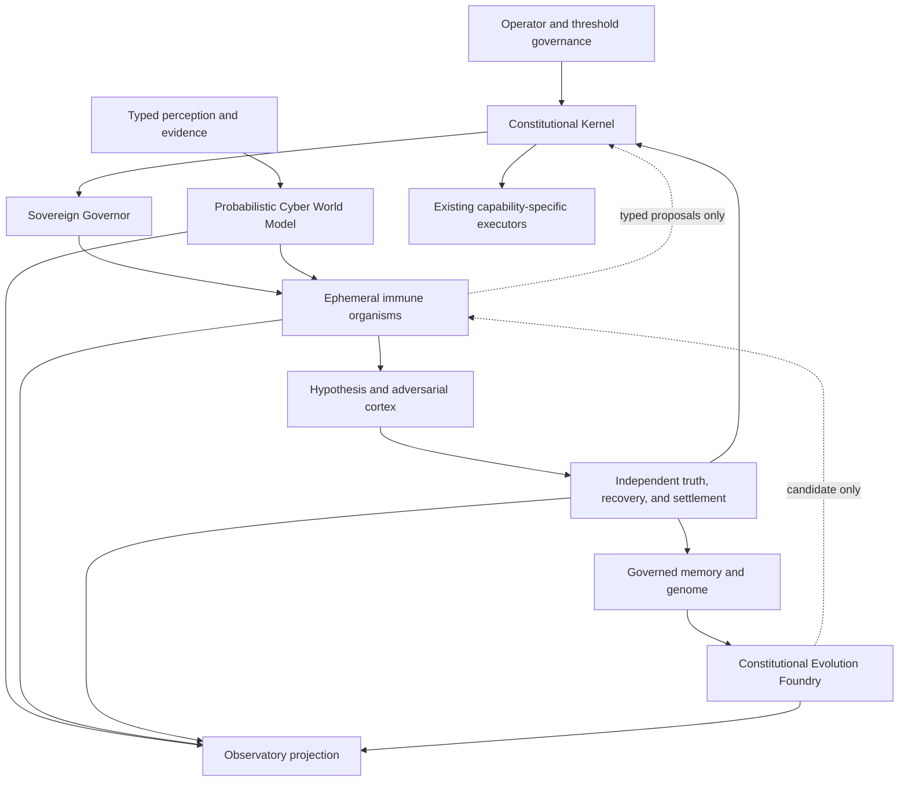

# nimrod vNext master plan

Subtitle: Constitutional Autonomous Cyber Immune System (CACIS)  
Status: `TARGET_ARCHITECTURE_ACCEPTED_IMPLEMENTATION_GATED`  
Governing doctrine: `DOCTRINE.md` v0.1  
Machine contract: `specs/cacis-capability-roadmap.schema.json`

## Executive decision

nimrod vNext is a constitutional cyber immune system, not a renamed SIEM, SOAR, XDR, C2 framework, or unconstrained agent swarm. It will continuously model the protected world, create competing benign and adversarial explanations, challenge its own evidence, propose bounded defense and authorized validation work, independently verify state and recovery, and distill incidents into candidate-only future capabilities.

This direction changes intelligence architecture, not authority. The existing Constitutional Kernel remains the only deterministic authorization plane. The Sovereign Governor can schedule work but cannot authorize an effect. Immune organisms are ephemeral, capability-bound, resource-bounded, and proposal-only. The World Model is derived state, not truth by assertion. Verification remains independent. The Evolution Foundry can emit candidates but cannot promote itself, execute a candidate, change trust, or modify doctrine.

## Constitutional laws

1. **Truth before action.** Claims require evidence, provenance, counter-evidence, causal lineage, and independent verification appropriate to impact.
2. **Authority never evolves.** Operator authority, execution authority, constitutional law, trust anchors, threshold signatures, evidence law, recovery verification, cryptographic trust, promotion requirements, and safety ceilings are immutable inputs to learning.
3. **Security is a living world.** The operating loop is observation, understanding, hypothesis, challenge, verification, recovery, and learning.
4. **Every decision survives skepticism.** Unknown, deceptive, abstain, disagreement, timeout, and recovery-unverified remain valid terminal states.
5. **Every failure creates governed knowledge.** Incidents may produce lessons, patterns, theories, and genome candidates only after evidence, privacy, complexity, replay, and evaluation gates.

These laws refine the vNext target and do not supersede `DOCTRINE.md`.

## Selected architecture

The selected shape is a **federated constitutional immune plane**. It reuses the existing authority kernel, Witness, verifier, Crucible, swarm, Foundry, and control-board boundaries while adding four new logical capabilities: event-sourced world state, ephemeral organism lifecycle, competing hypothesis/metacognition, and governed genome/evaluation. We deliberately avoid creating empty top-level packages or a service per agent before contracts and replay evidence justify those boundaries.

## Logical capability map

| Plane | Responsibilities | Maximum outcome | Existing foundation |
|---|---|---|---|
| Constitutional Kernel | Authority, permissions, evidence, execution, recovery, promotion, evolution, replay law | Deterministic policy decision | Authority and capability contracts |
| Sovereign Governor | Spawn, schedule, meter, pause, and terminate organisms | Scheduling decision | Swarm mission and resource lineage concepts |
| Immune Runtime | Assemble temporary investigation cells and retain typed outcomes | Typed proposal | Seven-cell governed swarm |
| Cyber World Model | Identity, endpoint, network, cloud, threat, and recovery state | Derived state with uncertainty | Evidence bus and causal coverage contracts |
| Hypothesis Cortex and CIRE | Discover better investigation methods; preregister competing explanations; challenge, verify, and settle without generalizing | Ranked hypothesis set and candidate theory | Epistemic posture, verifier dissent, and Constitutional Intelligence Research Engine |
| Truth, Recovery, Settlement | Independent evidence and post-state checks | Verification or settlement | Witness and supervised verifiers |
| Genome and Foundry | Pattern distillation, partitioned evaluation, candidate lineages | Candidate bundle | Constitutional Evolution Foundry |
| Observatory | Causal, authority, evidence, confidence, health, and evolution views | Display projection | Signed control-board ingress |

The requested repository names are an end-state capability vocabulary. Near-term code stays in cohesive packages until ownership, isolation, scale, or deployment evidence warrants a split.

## Living world model

Every accepted observation is immutable input to a derived model generation. Derived state never overwrites source evidence and never silently resolves contradictions.

| Domain | Minimum state | Required uncertainty |
|---|---|---|
| Identity | principals, devices, credentials, secrets, trust, privilege, delegation, authorization, lateral paths | freshness, source disagreement, ownership, reachability |
| Endpoint | processes, services, drivers, memory, registry, persistence, exposure, integrity | collection gaps, unsupported fields, tamper suspicion |
| Network | flows, routes, firewalls, DNS, TLS, segmentation, latency | attribution gaps, asymmetric visibility, clock skew |
| Cloud | identity, compute, storage, containers, IAM, secrets, policies, supply chain | provider scope, eventual consistency, tenant boundary |
| Threat | campaigns, TTPs, capabilities, novelty, confidence | source reliability, contamination, alternative explanation |
| Recovery | snapshots, backups, containment, integrity, residual risk | restore coverage, validation age, verifier independence |

The first implementation is a deterministic replay model. Continuous sensors and production graph infrastructure remain later gates.

## Dynamic immune organisms

An incident spawns the smallest useful temporary organization from typed cells such as identity, endpoint, network, cloud, memory, threat, containment, recovery, evidence, verification, historian, adversary, and shadow. A credential-theft organism may differ from a suspicious-script organism. The Governor grants a short-lived mission and resource lease; it does not grant execution rights.

Every organism must have:

- a typed mission, scope, time budget, resource budget, evidence parent, and policy version;
- at least one challenger and an independent verifier for consequential claims;
- a Shadow Controller that can pause, downgrade, add challenge, terminate, or abstain, but cannot authorize;
- explicit completion, timeout, disagreement, and termination receipts;
- a knowledge-retention decision that separates source evidence, derived lessons, and genome candidates.

The organism dies at mission end. Credentials, leases, scratch state, and conversational context expire. Only approved typed evidence, decisions, and candidate knowledge survive.

## Typed immune protocol

Unrestricted agent chat is never an authority or evidence channel. The canonical protocol will cover Observation, Measurement, Hypothesis, Counter Evidence, Unknown, Abstain, Threat Claim, Containment Proposal, Recovery Proposal, Verification, Settlement, Mutation Proposal, and Health Alert. Every message binds evidence references, confidence vector, authority class, event time, parent event, principal and process identity, agent version, policy version, and digest.

Content from telemetry, threat intelligence, models, retrieved documents, source repositories, or other agents remains tainted data. A parser may normalize it; no text becomes a target, command, permission, signature, or policy.

## Hypothesis and metacognition

Each material event creates competing hypotheses: benign activity, authorized administration, maintenance, configuration drift, credential theft, persistence, malware, supply-chain compromise, insider activity, false positive, sensor failure, unknown, novel attack, and deception where relevant. Challengers test telemetry gaps, poisoning, replay mismatch, simulation artifacts, model hallucination, and threat-intelligence corruption.

Confidence is a vector, never a single agent vote:

- model confidence;
- evidence confidence;
- telemetry confidence;
- historical confidence;
- calibration confidence;
- verification confidence;
- recovery confidence.

Final settlement may remain known, partially known, unknown, novel, deceptive, or outside authority. Consensus cannot erase dissent or missing evidence.

## Metabolism, homeostasis, and Chronos

The Governor allocates bounded CPU, memory, storage, telemetry, model, sandbox, simulation, verification, and investigation budgets by expected information gain, expected risk reduction, and expected recovery improvement. Spending cannot increase authority.

Homeostasis tracks telemetry freshness, evidence completeness, trust health, identity health, model diversity, sensor health, recovery health, verification backlog, threat pressure, false positives, confidence inflation, agent diversity, and resource pressure. Chronos defines separate deadlines and staleness rules for millisecond endpoint work, second-scale identity work, minute containment decisions, hour recovery, day threat intelligence, week architecture evaluation, and month capability evolution.

## Memory, genome, and evolution

Memory is stratified: observation, incident, investigation, containment, recovery, failure, theory, genome, and civilization. Promotion between layers requires provenance, privacy classification, redaction policy, replay success, and independent review. Raw evidence is never silently converted into reusable instruction.

Genome candidates may encode investigation patterns, containment and recovery playbooks, threat models, verification strategies, telemetry priorities, simulation methods, and agent morphologies. The Foundry evaluates visible, private, and external partitions, then applies hard gates for leakage, contamination, simulator or verifier exploitation, authority growth, confidence gaming, recovery gaming, policy manipulation, and complexity inflation. Complexity, state size, dependencies, replay cost, runtime, maintainability, explanation cost, and dead code must be measured and distilled before any candidate advances.

Recursive levels 0 through 5 may improve detection, investigations, organisms, metacognition, evolution, and the improver. Every level remains candidate-only. None may modify constitutional authority.

## Offense and defense integration

Offensive emulation is an immune challenge capability, not a master privilege. Crucible retains the only route to effects: signed authorization lease, immutable owner-controlled target graph, source-to-offline-replica separation, isolated range, safe-realism ceiling, resource budget, independent kill, cleanup contract, recovery evidence, and threshold settlement. Public hosts, third-party deployments, maintainers, package registries, and unknown ownership remain outside target scope.

Red organisms produce typed hypotheses and campaign proposals. Blue organisms measure state and telemetry. Purple organisms compile causal validation plans and compare expected with observed evidence. None receives raw-command bridging or ambient credentials. Existing Mythic, Sliver, Caldera, Atomic Red Team, Wazuh, Velociraptor, Elastic/OpenSearch, BloodHound, and VECTR integration plans remain connector-bound and independently gated.

## Observatory

The Observatory is the evidence-first security IDE, dashboard, and control board. Its center is the world model; surrounding projections show active organisms, competing hypotheses, dissent, trust, recovery, evidence lineage, confidence vectors, verification, genome, evolution, metabolism, homeostasis, and kill state. Every consequential card exposes origin, freshness, missing evidence, authority ceiling, policy version, and digest.

The UI consumes only signed, freshness-bound, monotonic projections. It cannot authorize, execute, promote, provision, contact targets, or reinterpret blocked state.

## Benchmark constitution

CACIS reports detection quality, false positives, false negatives, calibration, recovery quality, verification quality, containment quality, investigation efficiency, resource efficiency, agent contribution, genome improvement, evolution quality, metacognitive quality, and governance preservation. No aggregate score can override a hard failure, an unknown recovery state, an authority violation, or an evaluator-integrity failure.

Security arenas cover credential theft, ransomware, cloud, containers, supply chain, identity, insider behavior, novel malware, living off the land, privilege escalation, misconfiguration, recovery, purple validation, and metacognition. Early arenas are deterministic replay. Later range arenas require the existing Crucible gates.

## Eight implementation waves

| Wave | Deliverable | Exit proof | Current state |
|---|---|---|---|
| W0 Constitutional spine | Source brief, ADR, architecture portfolio, roadmap contract | Schema, semantic, and adversarial validation | Contract-only validated |
| W1 World model | Immutable observation ledger, successor generations, durable source cursors, and governed intake | Provenance, contradiction, staleness, deduplication, gaps, causal replay, recoverable publication, threshold signatures, no-drop backpressure, and retention projections | Governed succession replay validated |
| W2 Immune runtime | Governor, organism, shadow, lifecycle, and resource-lease simulator | Spawn, pause, abstain, timeout, termination, knowledge survival | Replay validated |
| W3 Hypothesis cortex | Constitutional Intelligence Research Engine, competing hypotheses, challenge, metacognition, settlement | Preregistered paired replay, dissent, counter-evidence, logical read-only verification | Replay validated |
| W4 Homeostasis and Chronos | Nine-resource metabolism, thirteen-signal health, scheduling, and seven domain clocks | Backpressure, confidence inflation, verifier backlog, stale, and expiry cases | Replay validated |
| W5 Genome evaluation | Memory stratification, lineage, partitions, reward-hacking and complexity gates | Candidate-only evaluation plus assurance-bound autonomous Tier A/B shadow promotion and regression demotion | Replay validated |
| W6 Arenas and Observatory | Multidimensional benchmark and signed display projections | Fifteen explicitly synthetic deterministic replay scenarios plus threshold-signed display-only proof | Full synthetic replay set validated; live blocked |
| W7 Crucible integration | Qualified organisms connected to owner-controlled range effects | Live isolated-range authorization, abort, cleanup, recovery, verification | Blocked by existing gates |

No wave changes authority. Each wave adds a bounded contract and replay harness before runtime capability.

## Current truth and blockers

Completed: normalized owner brief, selected architecture, doctrine-subordinate roadmap, W1 World Model replay with predecessor-bound succession, durable source cursors, explicit deduplication and gaps, separate-process causal verification, recoverable publication, and two-role threshold-signed replay source policy, health, and intake decisions. W1 now applies no-drop defer-newest backpressure, zero-second raw-event retention, bounded immutable-history projections, freshness and clock-skew assessment, and independent recomputation across 19 governance attacks. Two W2 organism morphologies, the W3 Constitutional Intelligence Research Engine with separate-process structural verification, W4 metabolism/homeostasis/Chronos, W5 genome evaluation, and W6 replay arenas with threshold-signed display-only Observatory projection are also replay validated. W5 preserves nine memory strata, visible/private/external replay partitions, all nine reward-hacking defenses, seven complexity metrics, and distillation under ten fail-closed cases. Its cross-cutting promotion controller now makes independently assured 2-role threshold advancement the autonomous Tier A/B default, atomically registers one shadow receipt, and automatically demotes a regressed shadow candidate; active-baseline mutation, candidate execution, Tier C/D autonomy, and production promotion remain false. W6 evaluates fifteen explicitly synthetic scenarios across fourteen dimensions, keeps all fifteen live-gated, and verifies a two-role threshold signature under nine fail-closed cases. The 97-contract matrix now gives every contract an exact independent-harness reference, and a live read-only probe exposes the identity and custody blockers for three verifier surfaces. None provides policy-ready live sensing, production isolation, target contact, execution, real external replication, production scheduling, or production-independent settlement.

Still blocked: signed and policy-ready live multi-domain sensor admission; production-enforced retention and backpressure; separately administered World Model verification; production-grade organism isolation; real private/external evaluators and replication; design-partner evidence; owner-approved budget and accountable leads; disposable range provisioning; independently retained live range evidence; production custody; and any public protection claim.

The machine completion audit marks all fifteen locally executable roadmap and product-foundation gates complete, including wheel-content integrity, while preserving six operational gate families as externally blocked. This is repository-foundation completion, not deployed-product or production-protection completion.

## Immediate next waves

1. Replace replay-only ephemeral source-governance custody with real collector identity, production key custody, trusted time, enforced retention and backpressure, and a separately administered verifier before considering live World Model admission.
2. Extend the now-complete 97-contract semantic and independent-harness matrix with exact runtime-source bindings only where a real runtime consumer exists; do not infer runtime coverage from naming.
3. Replace the live readiness probes with dedicated OS accounts, enforced ACL/egress controls, separate administration, and production custody only through an owner-approved infrastructure change; then run genuinely sealed private and external evaluations.
4. Keep W7 blocked until an owner-controlled disposable range proves authorization, abort, cleanup, recovery, and independent post-state evidence.
