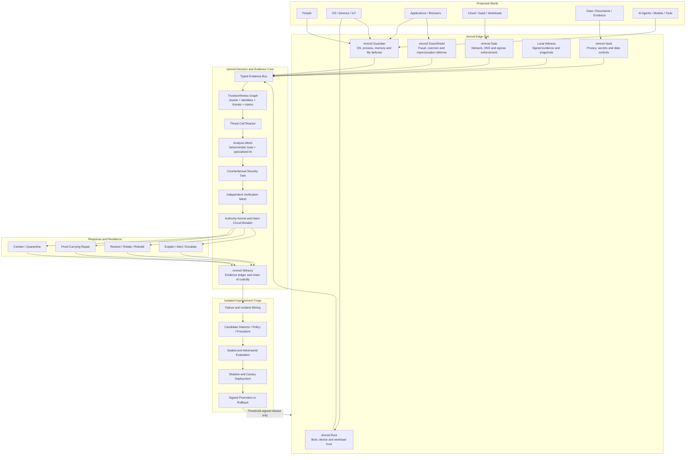

# nimrod

## **Networked Immune Mesh for Resilient, Observable Defense**

**Classification:** Universal security, privacy, trust, evidence, resilience, and autonomous recovery fabric.

**Primary objective:** Protect people, operating systems, devices, identities, data, applications, networks, cloud services, communications, software supply chains, AI agents, evidence, and digital work through one interoperable system.

nimrod should not be positioned as another antivirus, EDR, SIEM, firewall, fraud detector, or AI security agent. It is a **security operating fabric** that coordinates and governs all of them.

---

## Reality constraint

No architecture can truthfully guarantee prevention of every future exploit, malicious insider, coerced user, compromised hardware root, fraudulent authority, unavailable fact, or novel physical attack. nimrod therefore defines “complete protection” as:

> **Continuously prevent what can be prevented; detect what bypasses prevention; contain it before material harm; recover to a verified state; preserve trustworthy evidence; and measurably improve without gaining uncontrolled authority.**

This follows the stronger cyber-resilience model of anticipating, withstanding, recovering from, and adapting to compromise rather than assuming perfect prevention. It also adopts zero trust: network location, device ownership, and prior authentication never create permanent implicit trust. 

### Name and novelty

The proposed expansion is:

> **nimrod — Networked Immune Mesh for Resilient, Observable Defense**

The name has prior unrelated use in distributed and grid computing, including the historical nimrod/g architecture. Consequently, the architecture can be novel while the word itself is not globally unique. Trademark and patent novelty require dedicated legal searches beyond an architectural prior-art review.

A more distinguishable full product name would be:

## **nimrod Universal Defense Fabric**

---

# 1. Central design thesis

nimrod is governed by one rule:

> **Every sensitive object, claim, identity, model, communication, action, repair, and update must carry evidence and bounded authority.**

An AI model can identify, recommend, simulate, explain, or propose. It cannot independently authorize itself, grant itself credentials, alter its governing policy, promote its own update, erase evidence, or declare its own work verified.

The authoritative sequence is:

```text
Observe
   ↓
Normalize and classify
   ↓
Correlate with identities, assets, history, and evidence
   ↓
Form hypotheses
   ↓
Run deterministic tests and discriminating checks
   ↓
Simulate candidate responses
   ↓
Request a narrowly scoped capability
   ↓
Policy and risk authorization
   ↓
Contain, repair, restore, or challenge
   ↓
Verify the resulting state independently
   ↓
Create signed evidence
   ↓
Learn through an isolated improvement process
```

---

# 2. nimrod architecture



---

# 3. Non-negotiable security invariants

| Invariant | Enforcement |
|---|---|
| **No ambient authority** | Every user, process, service, model, and agent receives narrow, expiring capabilities. |
| **No direct AI execution** | Model output is untrusted data until compiled into a typed action and approved by policy. |
| **No content-to-command transition** | Emails, webpages, documents, images, retrieval results, and tool output can never silently become control instructions. |
| **No single-signal truth** | High-impact decisions require corroborating evidence or a deterministic oracle. |
| **No unverifiable repair** | A fix requires reproduction, tests, postconditions, provenance, and rollback. |
| **No invisible surveillance** | Collection, retention, export, and cloud processing are visible and policy-controlled. |
| **No permanent credentials** | Prefer short-lived, resource-specific identity and capability grants. |
| **No unsigned update** | Software, models, policies, rules, and datasets require signed provenance and release authorization. |
| **No self-approved evolution** | A candidate version cannot edit or select its evaluator, policy root, hidden tests, or promotion rule. |
| **No destructive automation without compensation** | Irreversible actions require independent authorization; reversible actions require tested rollback. |
| **No missing chain of custody** | Consequential observations and responses produce integrity-protected evidence receipts. |
| **No success without post-state validation** | An API success response is insufficient; nimrod verifies the actual resulting state. |
| **No counter-hacking** | nimrod protects, isolates, investigates, and recovers; it does not attack external infrastructure. |
| **No dependence on one vendor or model** | Models, scanners, storage, intelligence feeds, and cloud services remain replaceable. |

---

# 4. The nimrod Action and Evidence Envelope

All consequential operations use the same machine-verifiable envelope.

```json
{
  "envelope_version": "1.0",
  "event_id": "uuid",
  "mission_id": "uuid",
  "timestamp": "trusted-time",
  "actor": {
    "principal_id": "user-process-service-or-agent",
    "actor_type": "human|process|service|model|agent",
    "authentication": [],
    "device_attestation": "reference-or-null",
    "workload_attestation": "reference-or-null"
  },
  "intent": {
    "operation": "isolate_process",
    "purpose": "contain suspected credential-stealing behavior",
    "target": "process-and-descendants",
    "requested_capability": "endpoint.process.isolate"
  },
  "context": {
    "data_classification": "confidential",
    "incident_id": "uuid",
    "supporting_evidence": [],
    "contradicting_evidence": [],
    "uncertainties": []
  },
  "risk": {
    "impact": "medium",
    "confidence_interval": [0.91, 0.98],
    "blast_radius": "single-user-session",
    "reversibility": "fully-reversible",
    "urgency": "active-threat"
  },
  "execution_contract": {
    "preconditions": [],
    "expected_state_delta": {},
    "prohibited_side_effects": [],
    "resource_limits": {},
    "idempotency_key": "uuid",
    "expires_at": "timestamp"
  },
  "recovery": {
    "snapshot_required": true,
    "rollback_operation": "restore_process-policy-and-session",
    "compensation_plan": []
  },
  "verification": {
    "required_oracles": [],
    "independent_verifiers": [],
    "success_postconditions": [],
    "failure_postconditions": []
  },
  "authorization": {
    "policy_decision": "allow|limit|challenge|deny|escalate",
    "policy_version": "hash",
    "approvals": []
  },
  "signatures": []
}
```

This envelope gives nimrod a common security language across operating systems, network controls, cloud resources, documents, payments, AI agents, and automated repairs.

---

# 5. Core subsystems

## 5.1 nimrod Root — hardware and workload trust

`nimrod Root` establishes the strongest obtainable identity for a device or workload.

It handles:

- Measured and verified boot
- Firmware and configuration measurement
- Hardware-backed device identity
- Secure local key storage
- Workload and container attestation
- Recovery-key protection
- Trusted time anchoring
- Anti-rollback state
- Peripheral and removable-device trust
- Cryptographic agility

A device is not simply marked “trusted.” Its attested properties become evidence considered for each resource request. IETF remote-attestation architecture distinguishes raw evidence, evidence appraisal, and the relying party’s final appraisal; nimrod preserves that separation. SPIFFE-style short-lived workload identities can represent services without distributing permanent shared secrets. 

nimrod should be cryptographically agile and support migration to NIST-standardized post-quantum algorithms, including ML-KEM, ML-DSA, and SLH-DSA where their performance and interoperability are appropriate. It should not blindly replace every existing algorithm without compatibility and side-channel validation. 

---

## 5.2 nimrod Guardian — universal endpoint defense

Each protected device receives an `Edge Cell`. Its privileged component should be deliberately small, memory-safe, independently audited, and incapable of general-purpose AI inference.

### Observed domains

- Process creation, ancestry, injection, and termination
- Loaded modules and executable provenance
- File creation, modification, encryption, deletion, and mass access
- Memory and credential-access indicators
- Authentication, session, and privilege changes
- Registry, configuration, service, and scheduled-task changes
- Kernel, driver, extension, and boot-state changes
- Network flows and name resolution
- Clipboard, screen capture, camera, microphone, and accessibility access
- Removable media and external peripherals
- Browser downloads, extensions, sessions, and navigation
- Local AI agents, automation tools, shells, and interpreters
- Backup health and restoration readiness

### Enforcement

- Application allowlisting and reputation
- Process-tree isolation
- System-call and capability restriction
- Exploit mitigation
- Ransomware canary files and behavioral interruption
- Secret and credential access mediation
- File integrity protection
- Controlled privilege elevation
- Sandboxed execution
- Device and peripheral quarantine
- Data-loss prevention
- Session invalidation
- Emergency network isolation

The privileged sensor and enforcement kernel should remain separate from higher-level analytics. A compromised model or detector must not compromise the enforcement root.

---

## 5.3 nimrod Identity and Capability Mesh

nimrod models every active entity as a principal:

```text
Person
Device
Process
Application
Browser extension
Workload
Service
Container
Cloud function
Automation
AI model
AI agent
Tool
External organization
```

A principal receives a capability describing exactly:

```text
WHO may do WHAT
to WHICH resource
for WHICH purpose
using WHICH data
for HOW LONG
under WHICH risk conditions
with WHICH approval and evidence requirements
```

Example:

```text
ai-agent-42 may read:
  repository/project-a/src/**

It may not:
  read secrets
  modify workflow files
  push a branch
  access unrelated repositories
  contact arbitrary network destinations

Grant expires:
  after 10 minutes or mission completion
```

The policy decision point must remain deterministic and independent of the requesting agent. OPA is one open policy-engine foundation that explicitly separates policy decisions from enforcement. nimrod combines that model with short-lived workload identities and zero-trust resource decisions. 

---

## 5.4 nimrod Gate — network and egress defense

Traditional security concentrates on inbound traffic. nimrod treats **outbound authority** as equally important.

`nimrod Gate` controls:

- DNS and domain-resolution policy
- Host firewalling
- Network microsegmentation
- Encrypted device and workload mesh
- North-south and east-west flow analysis
- Application-aware egress
- Tor, proxy, tunnel, and covert-channel indicators
- Cloud API traffic
- SaaS connections
- Browser isolation
- Email ingress and egress
- Data upload and synchronization
- IoT and home-network segmentation
- Remote administration
- Emergency segment isolation

Every significant outbound flow is connected to:

```text
process → identity → destination → data classification → purpose → policy
```

This permits a rule such as:

> “The document editor may upload this public file to the approved collaboration service, but an unsigned extension may not upload confidential text to an unknown domain.”

nimrod Gate should function in personal, home-gateway, enterprise, cloud, and disconnected environments. Cloud connectivity must not be required for basic endpoint enforcement.

---

## 5.5 nimrod Vault — data and privacy control

`nimrod Vault` protects the information itself, not merely the device containing it.

It provides:

- Automatic and user-defined data classification
- Secret discovery and rotation
- Per-user and per-workload encryption
- Encrypted backup and recovery
- Local key custody
- Selective disclosure
- Retention and deletion policies
- Clipboard and screenshot controls
- Document and database lineage
- Data-loss prevention
- Privacy-preserving analytics
- Consent and purpose tracking
- Cross-border and residency restrictions
- Canary records and honeytokens
- Secure export packages
- Local-only inference for restricted information

### Privacy router

Before information reaches a model, tool, service, or external analyzer, the privacy router chooses among:

1. Local deterministic processing
2. Local model processing
3. Redacted external processing
4. Confidential-computing processing
5. Federated or aggregate analysis
6. Explicitly approved full disclosure
7. Denial

The user must be able to inspect, revoke, export, and delete stored personal context.

---

## 5.6 nimrod ScamShield — human-layer protection

Security products often protect machines while leaving users exposed to coercion, impersonation, urgency, fraudulent authority, and manipulated interfaces. `ScamShield` treats these as first-class threats.

### Protected channels

- Email
- SMS and messaging
- Browser pages
- Social platforms
- Phone and video calls
- QR codes
- Documents and invoices
- Remote-support tools
- Cryptocurrency transfers
- Banking and payment interactions
- Marketplace transactions
- Account-recovery workflows
- AI-generated media

### Analysis layers

```text
Sender and account identity
        +
Domain, URL and application provenance
        +
Conversation history
        +
Language and coercion patterns
        +
Requested action
        +
Transaction and beneficiary context
        +
Device and session state
        +
Media provenance and manipulation signals
        +
Independent contact verification
```

### Interventions

- Explain the suspicious indicators
- Open unknown content in isolation
- Disable dangerous active content
- Require out-of-band identity verification
- Verify a request through an independently retrieved contact path
- Add a cooling-off period
- Require a second trusted person for a high-risk transaction
- Block remote-control installation during suspicious conversations
- Prevent clipboard replacement of payment or wallet addresses
- Pause credentials, payment, or account-recovery actions
- Preserve privacy-controlled evidence for reporting

Content credentials, signatures, metadata, and watermarks are evidence signals—not proof that a claim is true. Recent research has demonstrated that individually valid provenance and watermark signals can contradict one another, reinforcing nimrod’s requirement for cross-layer corroboration. 

---

## 5.7 nimrod Trustworthiness Graph

nimrod’s central world model is not a vector database. It is a temporal, provenance-bearing graph.

### Node types

```text
People
Identities
Devices
Processes
Applications
Services
Networks
Files
Documents
Datasets
Secrets
Models
Agents
Tools
Claims
Evidence
Threats
Controls
Vulnerabilities
Incidents
Actions
Repairs
Versions
Policies
```

### Edge examples

```text
IDENTITY authenticated_on DEVICE
PROCESS accessed SECRET
FILE originated_from DOWNLOAD
CLAIM supported_by EVIDENCE
CLAIM contradicted_by EVIDENCE
AGENT requested CAPABILITY
VULNERABILITY reachable_from ENTRY_POINT
CONTROL mitigates THREAT
PATCH modifies COMPONENT
ACTION caused STATE_CHANGE
STATE_CHANGE verified_by TEST
```

Every graph element carries:

- Source
- Observation time
- Validity interval
- Confidence range
- Integrity hash
- Sensitivity label
- Jurisdiction
- Supporting and contradicting evidence
- Whether it is observed, inferred, assumed, predicted, or proposed

The defensive portion can map adversary behavior to countermeasures using knowledge-graph concepts such as MITRE D3FEND, which describes itself as a graph of cybersecurity countermeasures. 

---

## 5.8 nimrod Epistemic Firewall

The epistemic firewall separates **information** from **authority**.

```text
Untrusted email:
    may contribute threat evidence
    may not issue an agent instruction

Retrieved webpage:
    may support a factual claim
    may not redefine system policy

Tool output:
    may update observations
    may not grant itself another tool

Model response:
    may propose a plan
    may not authorize the plan
```

### Required controls

- Instruction/data separation
- Provenance labels in model context
- Taint tracking across retrieval and tool calls
- Structured output validation
- Tool-argument validation
- Destination allowlisting
- Secret stripping
- Output encoding and sanitization
- Prompt-injection detection
- Cross-agent message authentication
- Memory-write review
- Policy-signed system instructions
- One-way handling of hostile artifacts
- Context minimization

OWASP identifies prompt injection, insecure output handling, supply-chain weaknesses, sensitive-information disclosure, insecure plugin design, excessive agency, and overreliance among key risks for LLM applications. Its agentic-security work extends the analysis to autonomous systems. nimrod treats these as architectural failure modes rather than prompt-writing problems. 

---

## 5.9 nimrod Threat Cell Reactor

A permanent omnipotent “security AI” would become a catastrophic single point of compromise. Instead, nimrod creates an ephemeral `Threat Cell` for each material incident.

A cell may contain:

| Role | Responsibility |
|---|---|
| Correlator | Builds the incident timeline and affected-object graph. |
| Endpoint specialist | Examines process, file, memory, and persistence behavior. |
| Network specialist | Examines traffic, destinations, protocols, and lateral movement. |
| Identity specialist | Examines sessions, tokens, privilege, and impersonation. |
| Scam specialist | Evaluates coercion, fraud, sender, and transaction context. |
| Code specialist | Locates vulnerable or malicious code paths. |
| Evidence specialist | Preserves provenance and chain of custody. |
| Red-team specialist | Attempts to falsify the current hypothesis. |
| Recovery specialist | Designs containment and restoration. |
| Independent verifier | Determines whether evidence supports the proposed action. |

Each role receives only the minimum data and tools needed for that incident. The cell dissolves when the incident is closed, and only validated lessons enter durable memory.

Model voting is not treated as proof. When specialists disagree, nimrod seeks a discriminating observation or executable test.

---

## 5.10 nimrod Counterfactual Security Twin

Before making a disruptive change, nimrod constructs a temporary approximation of the affected environment.

The twin may include:

- Filesystem and configuration snapshot
- Process and service graph
- Network policy
- Identity relationships
- Application dependencies
- Database schema and safe data subset
- Browser state
- Cloud-resource model
- Expected user workflow
- Backup and recovery state

Candidate actions are tested against the twin:

```text
What legitimate workflow will this break?
Will isolation prevent data exfiltration?
Can the threat survive the proposed response?
Does credential rotation invalidate all sessions?
Will a patch create a regression?
Can rollback actually be performed?
What evidence will be lost?
```

For an active, high-confidence threat, a preauthorized reversible circuit breaker may isolate a process or session immediately. The twin is then used to select repair and restoration actions.

---

## 5.11 nimrod Governor and Harm Circuit Breaker

The governor is a small deterministic control plane. It must remain capable of stopping actions even if every AI component is wrong or compromised.

### Decision outcomes

```text
ALLOW
ALLOW WITH RESTRICTIONS
CHALLENGE
DELAY
RATE-LIMIT
ISOLATE
QUARANTINE
DENY
REQUIRE APPROVAL
ENTER EMERGENCY MODE
```

### Factors

- Identity and attestation
- Requested capability
- Data sensitivity
- Expected effect
- Reversibility
- Blast radius
- Evidence quality
- Threat urgency
- User policy
- Legal or organizational requirements
- Resource and financial limits
- Confidence calibration
- Availability of recovery

### Protected authority

AI components cannot directly modify:

- Root trust anchors
- Signing keys
- Core safety policy
- Mandatory approval rules
- Evidence-retention policy
- Hidden evaluation suites
- Release promotion rules
- Emergency stop mechanisms
- Their own capability ceilings

---

## 5.12 nimrod Repair Forge

`Repair Forge` handles vulnerabilities, malicious modifications, misconfigurations, broken trust, damaged data, and compromised credentials.

### Software repair pipeline

```text
Reproduce
   ↓
Localize the root cause
   ↓
Construct attack or failure path
   ↓
Generate a minimal candidate change
   ↓
Run static analysis
   ↓
Run targeted tests
   ↓
Run property, fuzz, and adversarial tests
   ↓
Run security and supply-chain checks
   ↓
Run regression and performance tests
   ↓
Verify the original path is no longer exploitable
   ↓
Create rollback and evidence package
   ↓
Canary or request approval
```

Recent frontier cyber-reasoning research supports combining models with static analysis, symbolic execution, directed fuzzing, and executable validation rather than relying on model reasoning alone. ATLANTIS used this hybrid architecture in AIxCC; other finalist systems autonomously found and patched real vulnerabilities, and the 2026 OSS-CRS project made AIxCC-derived techniques locally deployable against open-source projects. These systems provide strong inspiration, but their existence does not make autonomous remediation universally reliable. 

### Proof-carrying repair bundle

Every accepted repair contains:

```text
Affected component and version
Reproduction case
Root-cause explanation
Attack or failure path
Patch or corrective action
Change-scope map
Targeted test results
Regression results
Security-analysis results
Performance comparison
SBOM or AIBOM delta
Build provenance
Pre-state and post-state hashes
Residual risks
Rollback operation
Independent verifier signatures
```

The repair is not marked successful until the original vulnerable path and the resulting environment are both revalidated.

---

## 5.13 nimrod Witness — evidence and work-proof layer

`nimrod Witness` creates verifiable records without pretending that a ledger alone establishes truth.

### Evidence classes

| Class | Meaning |
|---|---|
| **E0 — Raw observation** | Sensor or external source output, preserved as observed. |
| **E1 — Attested observation** | Observation linked to an attested device or workload. |
| **E2 — Corroborated fact** | Supported by independent signals or an exact oracle. |
| **E3 — Derived result** | Deterministic calculation with inputs and method. |
| **E4 — Inference** | Probabilistic conclusion with alternatives and uncertainty. |
| **E5 — Forecast** | Expected future condition, explicitly time-bounded. |
| **E6 — Human assertion** | Signed statement that may still be mistaken or deceptive. |

### Evidence receipt

```json
{
  "evidence_id": "content-addressed-id",
  "incident_id": "uuid",
  "origin": "sensor-tool-person-or-system",
  "observation_time": "timestamp",
  "collection_time": "timestamp",
  "validity_interval": {},
  "source_identity": {},
  "device_or_workload_attestation": {},
  "content_hash": "sha256-or-agile-equivalent",
  "classification": "E0-E6",
  "supporting_material": [],
  "contradictions": [],
  "processing_history": [],
  "access_history": [],
  "retention_policy": {},
  "signatures": []
}
```

The evidence store should use content-addressed objects, trusted timestamps, append-only event history, integrity trees, and optional external transparency witnesses. It does not require a public blockchain.

For software and model artifacts, nimrod can combine SLSA provenance, Sigstore signing and transparency, in-toto supply-chain step attestations, and TUF-style resilient update distribution. These address different parts of provenance and update integrity and should be layered rather than treated as interchangeable. 

---

## 5.14 nimrod Recovery and Continuity Engine

Detection without dependable recovery is incomplete.

nimrod maintains:

- Versioned configuration snapshots
- Immutable or isolated backups
- Credential and token rotation procedures
- Clean-room rebuild capability
- Restore rehearsals
- Dependency-aware service startup
- Database recovery verification
- User-file recovery
- Golden images
- Offline recovery media
- Network and identity isolation modes
- Alternate communication channels
- Evidence preservation
- Business-continuity procedures

A restored system is not released merely because it boots. nimrod verifies:

```text
Boot and firmware state
Identity and credential state
Absence of known persistence
Software provenance
Data integrity
Network policy
Application functionality
Backup consistency
User-visible correctness
```

This implements the cyber-resilience objective of recovering and adapting after adverse conditions or compromise. 

---

# 6. Response ladder

nimrod uses graduated intervention rather than treating every anomaly as malware.

| Level | Action | Typical authority |
|---:|---|---|
| **0** | Observe and preserve evidence | Automatic |
| **1** | Explain, warn, or recommend | Automatic |
| **2** | Require step-up authentication or independent verification | Policy-controlled |
| **3** | Restrict a capability, destination, or data flow | Automatic when reversible |
| **4** | Suspend a process, session, extension, token, or transaction | Preauthorized or rapid approval |
| **5** | Quarantine a device, workload, account, or segment | High-confidence emergency policy |
| **6** | Roll back, rotate credentials, patch, rebuild, or restore | Verified reversible workflow |
| **7** | Destructive or externally consequential action | Independent human or external authorization |

A response escalates only when evidence, urgency, impact, and reversibility justify it.

---

# 7. Threat coverage

| Threat family | Prevention and detection | Containment and recovery |
|---|---|---|
| **Malware, ransomware, rootkits** | Provenance, application control, behavioral monitoring, process lineage, memory/file signals, exploit mitigation, ransomware canaries | Process-tree isolation, host quarantine, snapshot, credential rotation, verified restore |
| **Unknown and zero-day exploits** | Attack-surface reduction, sandboxing, fuzzing, runtime anomaly detection, control/data-flow analysis, least privilege | Microsegmentation, capability revocation, vulnerable-service isolation, generated and verified repair |
| **Phishing, business-email compromise, scams** | Sender and domain analysis, conversation graph, requested-action analysis, independent identity verification | Link isolation, transaction delay, account freeze, evidence preservation, reporting |
| **Deepfake and impersonation** | Multi-signal provenance, liveness where appropriate, relationship history, out-of-band confirmation | Prevent privileged or financial action until independent verification |
| **Credential and session theft** | Passkeys or strong authentication, device binding, short-lived credentials, secret mediation, behavior analysis | Token revocation, session invalidation, credential rotation, affected-resource review |
| **Rogue administrator or insider** | Separation of duties, just-in-time privilege, peer approval, behavioral and data-flow monitoring | Capability suspension, evidence preservation, scoped account isolation |
| **Rogue application or AI agent** | Epistemic firewall, sandbox, capability grants, tool restrictions, output validation | Tool revocation, session kill, memory quarantine, rollback of agent-created changes |
| **Data theft or privacy leakage** | Classification, encryption, DLP, purpose control, egress mediation, privacy routing | Flow termination, token revocation, exposed-data inventory, key rotation |
| **Data tampering and false evidence** | Signed provenance, append-only receipts, cross-source checks, data lineage | Restore verified version, isolate source, preserve conflicting evidence |
| **Network compromise** | Microsegmentation, encrypted identity-aware mesh, DNS and flow analysis, egress controls | Segment isolation, route revocation, credential rotation, topology verification |
| **Cloud and SaaS compromise** | Workload identity, policy-as-code, posture monitoring, configuration and activity graph | Revoke roles and tokens, isolate workload, restore configuration, verify downstream effects |
| **Software and AI supply chain** | SBOM/AIBOM, signed provenance, reproducible builds, dependency policy, dataset/model lineage | Block release, quarantine artifact, revert dependency, rebuild from verified sources |
| **Firmware, boot, physical theft** | Measured boot, hardware-backed keys, device encryption, peripheral policy | Remote capability revocation, data-key destruction, rebuild from verified media |
| **Misconfiguration and accidental damage** | Policy validation, typed changes, simulation, drift detection | Automatic rollback, configuration restoration, incident evidence |
| **Availability attack or disaster** | Rate and resource controls, redundancy, offline mode, restore testing | Failover, degraded safe mode, clean reconstruction |
| **Novel behavior outside known signatures** | Baseline deviation, graph inconsistency, canaries, multi-sensor anomaly detection | Reversible containment, forensic capture, threat-cell investigation |

The residual risk for each category must remain visible. nimrod should never display a meaningless “100% protected” badge.

---

# 8. Dual-reality verification

A major nimrod distinction is that it verifies both the underlying state and what the person sees.

```text
Logical reality:
  database value
  API response
  permissions
  process state
  network state
  payment destination

Visible reality:
  user interface
  browser page
  invoice
  confirmation screen
  email
  document
  dashboard
```

This catches failures such as:

- A UI says a security control is enabled while the backend policy is disabled.
- A bank or wallet screen shows one destination while the submitted transaction contains another.
- A report displays stale data.
- A “successful” patch did not reach the running service.
- An account appears logged out while a token remains active.
- A restore operation completes but the restored data is corrupt.
- A scam overlays or alters the trusted interface.
- An AI-generated report cites sources that do not support its claims.

nimrod validates the relationship:

```text
user intent
↕
displayed action
↕
submitted operation
↕
backend state change
↕
external effect
↕
verified outcome
```

---

# 9. Safe recursive improvement

nimrod may improve its procedures, detectors, models, routing, and code, but it must never possess unrestricted online self-modification.

## Loop 1 — Mission refinement

During an incident, nimrod may:

- Request more evidence
- Change its hypothesis
- Select another detector
- Generate another test
- Revise a proposed response

It may not rewrite its policy or deploy new privileged code.

## Loop 2 — Local immune memory

After a verified incident, nimrod extracts:

- Behavioral fingerprints
- Attack-path patterns
- Scam sequences
- False-positive causes
- Effective discriminating tests
- Effective containment procedures
- Recovery procedures
- Environment-specific exceptions

Unverified model summaries do not become durable security knowledge.

## Loop 3 — Federated immune exchange

Users may opt into sharing privacy-preserving security artifacts such as:

```text
Hashed or abstracted behavior patterns
Detection logic
Indicators with confidence and expiry
Attack-path templates
Repair test cases
Scam campaign structure
Detector-performance statistics
```

Raw personal files, conversations, browsing history, or proprietary source code are not shared by default.

## Loop 4 — Offline improvement forge

```text
Verified incident traces
        ↓
Root-cause and failure clustering
        ↓
Candidate detector, model, rule, procedure, or code
        ↓
Schema and static checks
        ↓
Public regression suites
        ↓
Sealed hidden suites
        ↓
Adversarial and poisoning tests
        ↓
Privacy and security review
        ↓
Shadow deployment
        ↓
Restricted canary
        ↓
Threshold-signed promotion
        ↓
Continuous rollback monitoring
```

### Constitutional separation

A candidate system cannot:

- See sealed tests
- Modify its evaluator
- Lower its acceptance threshold
- Change mandatory approvals
- authorize its own promotion
- erase failed experiments
- access production signing keys
- overwrite its previous stable version

Current NIST work continues to evolve AI risk-management guidance, including a 2026 concept note for trustworthy AI in critical infrastructure. OWASP similarly treats excessive agency and agentic threats as system-level risks. nimrod therefore makes recursive improvement subordinate to governance rather than assuming greater autonomy always means better performance. 

---

# 10. Deployment forms

## Personal

```text
nimrod desktop/mobile app
+ local Edge Cell
+ encrypted Vault
+ browser and communication protection
+ optional home gateway
+ local Witness
```

Default operation is local and automatic. The user receives plain-language explanations and reversible choices.

## Family

Adds:

- Shared scam and fraud protection
- Child and elder-safety modes without hidden surveillance
- Trusted-contact verification
- Family recovery keys
- Shared-device isolation
- High-risk payment confirmation
- Home IoT segmentation

## Professional and small business

Adds:

- Device fleet management
- Business-email protection
- SaaS controls
- Data classification
- Backup verification
- Software supply-chain checks
- Shared incident response
- Role separation

## Enterprise

Adds:

- Federated policy
- SOC integration
- Identity-provider integration
- Cloud and Kubernetes protection
- Data-residency enforcement
- Evidence export
- Enterprise attack graph
- Deception and canary systems
- Controlled autonomous remediation

## Critical infrastructure and air-gapped environments

Adds:

- Disconnected operation
- Strict deterministic control paths
- Hardware roots of trust
- Offline signed updates
- Redundant policy authorities
- Digital-twin validation
- Physical safety interlocks
- Mandatory human authorization
- Independent emergency shutdown
- Long-term evidence retention

The same event, identity, evidence, and action schemas are used across every profile. Only the scale and authority envelope change.

---

# 11. User experience

Universal protection will fail if ordinary people cannot understand or operate it.

nimrod Command should offer five views.

### 1. Protection view

```text
Devices
Accounts
Data
Network
Communications
Backups
Applications
AI agents
```

Each domain shows coverage gaps, not a deceptive single score.

### 2. “Why was this stopped?” view

Every intervention explains:

- What was observed
- What nimrod knows
- What remains uncertain
- What harm could occur
- What action was taken
- Whether it is reversible
- What evidence supports the decision
- How to safely override it

### 3. Emergency view

One control can:

- Disconnect external network access
- Stop untrusted remote-control sessions
- Freeze selected financial or identity actions
- Revoke active tokens
- preserve volatile evidence
- contact designated trusted people
- begin guided recovery

### 4. Privacy view

The user can inspect:

- What data was collected
- Where it is stored
- Who accessed it
- Which model or service processed it
- Why it was needed
- When it will be deleted
- How to revoke future processing

### 5. Proof view

Every important output can expose:

```text
Sources
Observations
Calculations
Tool and model versions
Execution receipts
Uncertainty
Approvals
Changes made
Verification results
```

---

# 12. Reference implementation

nimrod should expose stable interfaces while allowing individual tools to be replaced.

| Layer | Reference candidates |
|---|---|
| Privileged core | Rust, minimal native platform adapters |
| Plugin boundary | WebAssembly/WASI with signed capability manifests |
| Endpoint visibility | osquery, Falco, Tetragon, YARA-X, Velociraptor, Wazuh concepts and integrations |
| Network visibility | Zeek, Suricata, Cilium, encrypted-overlay integrations |
| Threat representation | STIX/TAXII, Sigma, MITRE ATT&CK/ATLAS/D3FEND mappings |
| Event normalization | OCSF-style schemas, Protobuf or CBOR envelopes |
| Workload identity | SPIFFE/SPIRE-style identities |
| Policy | OPA/Rego or a comparable deterministic policy system |
| Supply chain | SLSA, Sigstore, in-toto, TUF, SBOM and AIBOM generation |
| Software analysis | Tree-sitter, Semgrep, OSV-Scanner, AFL++, libFuzzer, symbolic-execution integrations |
| Autonomous vulnerability research | OSS-CRS and AIxCC-derived hybrid analysis patterns |
| Sandboxing | WASM, restricted containers, application sandboxes, microVM isolation |
| Durable workflow | Temporal-style durable workflows |
| Event transport | NATS JetStream, Kafka, or equivalent replayable transport |
| Transactional state | PostgreSQL |
| Graph state | Graph database or graph-capable relational design |
| Artifact storage | Content-addressed S3-compatible object storage |
| Search and analytics | OpenSearch, ClickHouse, or equivalent |
| Observability | OpenTelemetry, Prometheus, Grafana |
| Model runtime | Local models by default where possible; governed multi-provider gateway for optional frontier models |
| Update security | Threshold signing, transparency, anti-rollback metadata, offline verification |

SLSA, Sigstore, in-toto, and TUF provide useful open foundations for provenance, artifact signing, supply-chain step verification, and resilient software updates. 

---

# 13. Protecting nimrod from becoming the threat

An all-encompassing defense system is itself a high-value target. nimrod therefore requires stronger controls than the systems it protects.

## Required internal defenses

1. **Small trusted computing base:** privileged code contains no general-purpose model runtime.
2. **Open and auditable core:** core policy, envelope schemas, update verification, and evidence formats should be inspectable.
3. **Threshold authorization:** no single company service, model, administrator, or update key can silently take control.
4. **Local-first operation:** loss of cloud connectivity must not disable essential enforcement.
5. **No raw-data centralization by default:** personal telemetry stays local unless explicitly shared.
6. **Diverse detection:** critical decisions use different sensor and analysis families to reduce correlated failure.
7. **Independent watchdog:** a simpler component monitors the governor, update system, and privileged core.
8. **Reproducible releases:** binaries, models, policies, and rule packs are tied to source and build provenance.
9. **Anti-rollback:** attackers cannot force installation of an old vulnerable version.
10. **Emergency removal:** the owner has a verified method to disable or uninstall nimrod without losing access to their data.
11. **User-owned recovery:** access recovery is not dependent on a single vendor.
12. **No hidden master key:** there is no universal decryption or remote-control credential.
13. **Tamper-evident administration:** every policy and authority change creates evidence.
14. **Bypass testing:** red teams continuously attempt to manipulate sensors, models, memory, updates, and evidence.
15. **Fail-mode policy:** each control declares whether it fails open, closed, isolated, or degraded.
16. **Version coexistence:** stable rollback versions remain independently deployable.
17. **No monetized surveillance:** security telemetry is not repurposed for advertising or unrelated profiling.

---

# 14. Proposed architectural novelty

These are **candidate novel combinations**, not a legal conclusion that no prior art exists.

| Candidate | Proposed advancement |
|---|---|
| **Universal Action and Evidence Envelope** | One typed, signed contract connects identity, intent, data sensitivity, predicted effects, authorization, rollback, and verification across endpoints, networks, cloud, fraud, and AI agents. |
| **Dual-Reality Verification** | Security decisions verify both machine state and the human-visible representation of that state. |
| **Threat Cell Reactor** | Ephemeral, heterogeneous analysis teams receive incident-specific capabilities and disappear after producing verified outputs. |
| **Counterfactual Containment Twin** | Candidate containment and recovery actions are tested against a temporary environment model before disruptive execution. |
| **Proof-Carrying Repair** | Every remediation carries a reproducer, evidence, tests, provenance, postconditions, and rollback rather than only a patch. |
| **Federated Immune Memory** | Environments exchange validated abstract threat and repair knowledge without sharing raw sensitive data by default. |
| **Unified Trustworthiness Graph** | Cyber attack paths, scam relationships, data lineage, evidence provenance, human identity, AI authority, control coverage, and recovery state exist in one temporal graph. |
| **Epistemic Firewall** | Untrusted information is technically prevented from becoming executable authority across retrieval, messaging, agents, and tools. |
| **Harm Circuit Breaker** | A model-independent kernel can revoke capabilities and stop dangerous action even when the analytic layer is compromised. |
| **Evidence-Driven Autonomy Budget** | Autonomy expands or contracts according to evidence quality, reversibility, impact, and historical calibration rather than a fixed “agent mode.” |

The strongest differentiation is the **combination**:

```text
Universal trust graph
+ proof-carrying actions
+ dual-reality verification
+ counterfactual response
+ privacy-preserving immune learning
+ deterministic authority
```

---

# 15. “S-tier” evaluation standard

nimrod cannot be declared best merely because its design is broad. It must outperform alternatives in independent, reproducible evaluations.

## Hard failure gates

Any of the following fails a release or mission:

- Unauthorized consequential action
- Fabricated or altered evidence
- Unreported destructive effect
- Unverified security repair
- Successful evaluator manipulation
- Secret exposure to an unauthorized model or service
- Failed rollback represented as successful
- Hidden lowering of policy protections
- Undisclosed material uncertainty
- Update without valid provenance
- Critical safety regression traded for better average performance

## Core metrics

| Dimension | Measurement |
|---|---|
| Prevention | Percentage of tested attacks stopped before execution or harm |
| Detection | Recall across known, mutated, and unknown-like behavior |
| Precision | Legitimate activity incorrectly interrupted |
| Containment | Time and scope between detection and effective isolation |
| Recovery | Percentage restored to a verified clean state |
| Data loss | Maximum confirmed loss during ransomware and destruction tests |
| Scam protection | Harmful interactions prevented with acceptable user burden |
| Identity defense | Account and session takeover prevention and recovery |
| Repair quality | Vulnerabilities fixed without regression or workaround bypass |
| Evidence quality | Material conclusions traceable to valid evidence |
| Calibration | Whether stated confidence matches observed correctness |
| Privacy | Data exposed beyond the minimum necessary |
| Performance | CPU, memory, latency, storage, battery, and bandwidth overhead |
| Availability | Protection retained under component, network, and cloud failure |
| Supply chain | Resistance to artifact, key, repository, dependency, and update compromise |
| AI-agent safety | Unauthorized tool use, prompt-injection success, and policy bypass |
| Resilience | Ability to anticipate, withstand, recover, and adapt |
| Usability | Safe completion rate by non-expert users |
| Accessibility | Protection usable through accessible interfaces and assistive technologies |

## Evaluation environments

- Public regression suites
- Sealed private suites
- Malware and ransomware ranges
- Network attack ranges
- Phishing, scam, and impersonation simulations
- AI-agent prompt-injection and tool-abuse tests
- Vulnerability-discovery and repair benchmarks
- Supply-chain compromise exercises
- Insider and administrator-abuse scenarios
- Device theft and recovery exercises
- Backup-destruction and disaster-recovery exercises
- Long-horizon, multi-stage attack scenarios
- Independent red teams
- Public bug bounty
- Shadow-production evaluation

The AIxCC results demonstrate both real progress and remaining limitations in autonomous vulnerability discovery and repair; the 2026 systematization specifically examines which architectural factors drove performance and which problems remain open. nimrod should use this kind of comparative evaluation rather than relying on model-brand claims. 

---

# 16. Construction sequence

## Phase 0 — Constitution and open specifications

Build and publish:

- Threat model
- Security invariants
- Action and evidence envelope
- Capability model
- Evidence classes
- Plugin manifest
- Update and signing model
- Privacy model
- Evaluation contract
- Emergency-stop design

## Phase 1 — Personal Edge Cell

Implement:

- nimrod Root
- Guardian
- Vault
- Local Witness
- Backup verification
- Process and network isolation
- Plain-language user interface

## Phase 2 — Identity and Network Mesh

Implement:

- Workload identity
- Short-lived capabilities
- Gate and egress mediation
- Home and small-business gateway
- Device federation
- Policy synchronization

## Phase 3 — ScamShield and Dual-Reality Verification

Implement:

- Browser, email, messaging, document, and transaction adapters
- Independent contact verification
- Interface-to-backend verification
- Coercion and impersonation detection
- Trusted-contact escalation

## Phase 4 — Trustworthiness Graph and Threat Cells

Implement:

- Unified asset, identity, claim, attack, evidence, and recovery graph
- Ephemeral specialist cells
- Independent verification mesh
- Counterfactual twin

## Phase 5 — Proof-Carrying Repair

Implement:

- Code graphing
- Reproduction generation
- Static, dynamic, fuzz, and symbolic analysis
- Patch generation
- Regression verification
- Signed repair packages

## Phase 6 — Enterprise and Critical Infrastructure

Implement:

- Federation
- Air-gapped operation
- Cloud and SaaS adapters
- SOC integrations
- Hardware-backed authority
- Redundant policy decision points
- Safety interlocks

## Phase 7 — Controlled Recursive Improvement

Implement only after the evaluation and rollback infrastructure is mature:

- Local immune memory
- Federated learning
- Improvement forge
- Sealed evaluation
- Shadow and canary releases
- Threshold-signed promotion
- Automatic regression rollback

---

# Final architecture definition

**nimrod is a local-first, federated, zero-trust, proof-carrying defense fabric that surrounds every user, device, identity, workload, network flow, data object, claim, AI agent, and system change with continuous observation, bounded authority, independent verification, trustworthy evidence, and reversible recovery.**

Its intelligence comes from models, deterministic tools, program analysis, behavioral detection, knowledge graphs, and human expertise. Its authority comes only from a separate policy kernel. Its credibility comes from evidence. Its survivability comes from isolation and recovery. Its improvement comes from sealed evaluation rather than uncontrolled self-rewriting.

That separation is what allows nimrod to pursue universal protection without becoming an unaccountable universal point of control.
